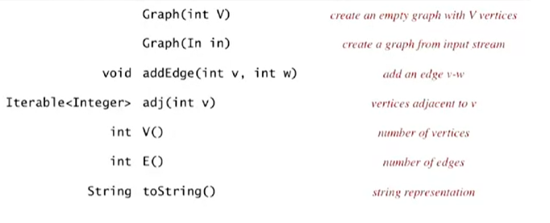
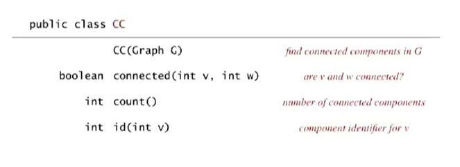
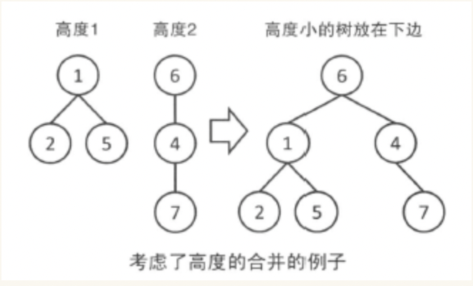

### 图论的典型问题
- vertex: 顶点；cycle: 环路
- Path
- Shortest Path
- Cycle
- Euler Tour（欧拉图）: Is there a cycle that uses each edge exactly once
- Hamilton Tour(哈密顿图): a cycle uses each vertex exactly once
- Connectivity(连通性): a cycle to connect all vertices
- MST(最小生成树): Best way to connect all vertices
- Biconnectivity(双向连通性): Is there a vertex whose removal disconnects the graph?
- Planarity(平台图): can you draw the graph in the plane with no crossing edges
- isomorphism(同构性)
### 无向图
#### API

- 每个节点对应一个编号，从0开始
- adj(int v): 返回节点v的所有邻接节点
#### 使用示例
```java
// read graph fron input stream and print every edge
In in = new In(args[0]);
Graph G = new Graph(in);

for (int i=0;i<G.V();i++) {
  for (int w: G.adj(v)) {
    Stdout.println(i + "-" + w);
  }
}
```
#### API 实现
##### 数据结构
1. 二维数组
- 每一个w-v边,有: adj[w][v] = adj[v][w] = true
2. Array of list
- 以节点编号作为数组下标
- 数据元素是一个链表，存储该节点的邻接结点
- 实际的链表实现，通过 Bag 数据结构完成
#### 深度优先搜索

```java
Paths P = new Paths(G, s);
for (int i=0; i<G.V(); i++) {
  if (P.hasPathTo(i)) {
    StdOut.print(i);
  }
}
```
#### Connected Components
- 连通性的定义: 如果节点v 和 节点w 之间存在 path, 则 v and w are connected
- 连通性是一个等价关系(equivalant relation)
- connected component: a maximum set of connected vertices
##### API 定义

##### 实现思路
- 找到一个结点，进行 DFS 遍历，所有该结点标记 CC[] = 0, 代表第0个连通组件
- 找到没访问过的结点，继续上述内容
- 直到所有节点访问完毕
#### Interview Questions
- 非递归版本的 DFS -- 使用辅助栈，见 DepthFirstPaths.java
### 有向图
#### 基本问题
- Path. v to x exists?
- Shortest Path
- 拓扑排序
- Strong connectivity? 强连通性？Is there a directed path between all pairs of vertices
#### Digraph Search
- DFS 和 BFS 同样适用。将无向图理解成两个方向都连接的有向图即可
#### 拓扑排序
- 存在先后约束关系的任务，如何排序？
- DFS，但输出结果应该反序 (递归时通过栈来完成)
#### Strong Components (强连通分量)
-  强连通的定义(Strongly Connected)：v and w: a directed path from v to w + a directed path from w to v
- Strong Component: a maximum set of strongly connected vertices
##### Kosaraju 算法
- 在 G.reverse() 计算逆后序 (reverse postorder)
- 根据 reverse postorder 中的顺序，在 G中进行 DFS, 得到强连通分量

### Minimum Spanning Trees
最小生成树
- 无向图中的一个子图
- tree (连通、无环) spanning (include all vertices)
- 找到这样的树中，权值最小的那个
- 应用: 修一条经过所有村庄的路，保证修路的花费最少

#### Edge-Weighted Graph API
- 见 week2/EdgeWeightedGraph.java

#### Kruscal 算法
https://blog.csdn.net/luomingjun12315/article/details/47700237
思路
```
1. 先将所有边排序
2. 按权值分别选择边，只要不造成回路 (cycle), 则加入该边
3. 直到所有节点都被访问过了 (MST.size() == V())
```

##### 并查集 Union Find
https://blog.csdn.net/luomingjun12315/article/details/47373345

两个操作:
- 查询 a,b 是否在同一组
- 将元素 a,b 合并为一组

数据结构: 每一组表示为树结构
- 是否在同一组 --> 检查根结点是否一致
- 合并为一组: 修改根结点到一致

代码
```c++
vector<int> parent;

void init(int n) {
  for (int i=0; i<n; i++) {
    parent.push_back(i); // 初始每个节点的父元素指向自己
  }
}

int find(int x) {
  if (x == parent[x]) return x;
  return find(parent[x]); // 沿着树往上找
}

void union(int x, int y) {
  x = find(x);
  y = find(y); // 分别找到根结点
  if (x == y) return;
  parent[y] = x;
}

bool same(int x, int y) {
  return find(x) == find(y);
}
```

针对所构造的树可能退化为线性结构
优化方案
- 记录树的高度
- 合并时，高度小的树 作为 高度大的树 的子树
- 从而使树更加平衡

代码
```c++
vector<int> parent;
vector<int> rank;

void init(int n) {
  for (int i=0; i<n; i++) {
    parent.push_back(i); // 初始每个节点的父元素指向自己
    rank.push_back(0);
  }
}

int find(int x) {
  if (x == parent[x]) return x;
  return find(parent[x]); // 沿着树往上找
}

void union(int x, int y) {
  x = find(x);
  y = find(y); // 分别找到根结点
  if (x == y) return;
  if (rank[x] < rank[y]) {
    parent[x] = y;
  } else {
    parent[y] = x;
    if (rank[x] == rank[y]) {
      rank[x]++;
    }
  }
  parent[y] = x;
}

bool same(int x, int y) {
  return find(x) == find(y);
}
```


