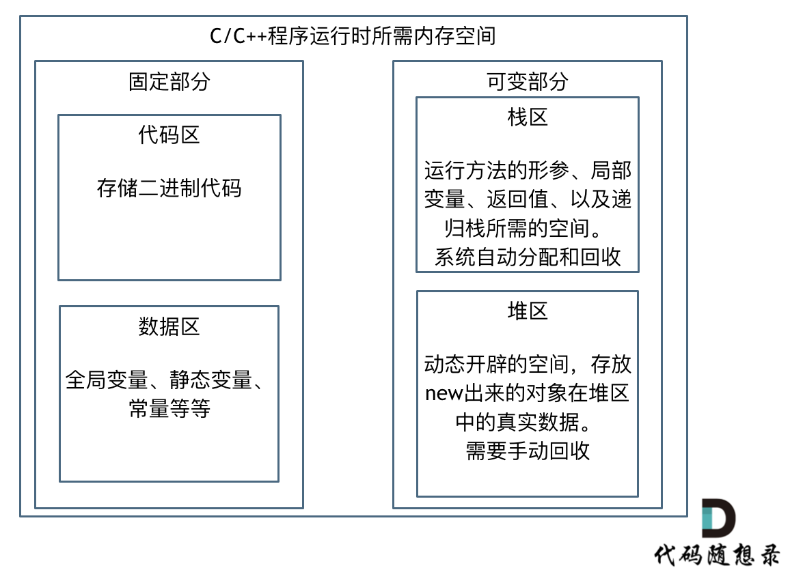
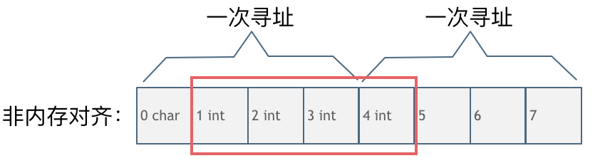

[toc]
## LabuLadong
### c++ 代码注意事项
#### 链表
```c++
ListNode* dummy1 = new ListNode(); // new 一个 struct
dummy1->val, dummy1->next; //访问成员变量
// 判断空指针: NULL
```
#### vector
```c++
vector<ListNode*> lists;
lists.size() // vector 长度
```
#### 优先级队列
```c++
priority_queue<ListNode* , vector<ListNode*>, decltype( comp )> pq(comp); // comp 是自定义的 comparator

auto comp = []( ListNode* a, ListNode* b ) { return a->val > b->val; }; // 对应一个小顶堆

priority_queue<int , vector<int>, greater<int>> pq; // 小顶堆

```


### 链表
- dummy 头结点很有用
#### 86.分隔链表
```c++
    ListNode* partition(ListNode* head, int x) {
        ListNode* dummy1 = new ListNode();
        ListNode* head1 = dummy1;
        ListNode* dummy2 = new ListNode();
        ListNode* head2 = dummy2;
        // 遍历原链表
        ListNode* node = head;
        while(node != NULL) {
            if(node-> val < x) {
                head1-> next = node; // 这个地方赋的是原节点的引用
                head1 = head1-> next;
            } else {
                head2-> next = node;
                head2 = head2-> next;
            }
            ListNode* temp = node->next; 
            node->next = NULL; // 因此要把原节点的 next 设置成 NULL
            node = temp;
        }
        // 组合两个链表
        head1->next = dummy2->next;
        return dummy1->next;
    }
```
#### 23. 合并k个有序链表
- 需要一个（小顶堆）优先级队列，每次出队目前的最小元素
- 所有链表的首个元素入队，每次最小元素出队，然后补充对应链表的下一个元素
- 时间复杂度分析
    - 优先级队列中有 k 个元素，因此每次入队，出队是$O(\log K)$(二叉堆作为实现方式)
    - 每个元素都需要入队出队，因此时间复杂度一共$O(N\log K)$
```c++
    ListNode* mergeKLists(vector<ListNode*>& lists) {
        priority_queue<ListNode* , vector<ListNode*>, decltype( comp )> pq(comp);
        ListNode* dummy = new ListNode();
        ListNode* node = dummy;
        for (int i=0; i<lists.size(); i++) {
            if (lists[i] != NULL) {
                pq.push(lists[i]); // 各链表头结点
            }
            
        }
        while (!pq.empty()) {
            ListNode* curNode = pq.top();
            node -> next = curNode;
            node = node -> next;
            pq.pop();
            if (curNode -> next != NULL) {
                pq.push(curNode -> next);
            }
        }
        return dummy -> next;
    }
```
#### 19. 删除链表的倒数第n个节点
- 倒数第 n 个节点: 如果希望只遍历一次的话，可以有一对快慢指针；
- 快指针多走 n 步，快指针到达NULL时，慢指针对应要删除的节点
- 保存慢指针的前一个节点
- dummy 头结点很有用！可以处理头结点需要删除的情况
```c++
    ListNode* removeNthFromEnd(ListNode* head, int n) {
        ListNode* dummy = new ListNode();
        dummy -> next = head;
        ListNode* fast = head;
        ListNode* slow = head;
        ListNode* slow_prev = dummy;
        int i=0;
        while (i<n & fast != NULL) {
            fast = fast -> next;
            i++;
        }
        if (i<n) {
            return NULL;
        }
        while (fast != NULL) {
            fast = fast -> next;
            slow_prev = slow;
            slow = slow -> next;
        }
        slow_prev -> next = slow -> next;
        return dummy -> next;
    }
```
### 数组
- 左右指针
- 快慢指针
    - 原地修改数组
#### 26. 删除有序数组中的重复项
- 由于需要原地修改数组，所以快慢指针
- 快指针遇到更大的数，就和慢指针的下一位交换，慢指针走一位
```c++
    void swap(int &a, int &b) {
        int temp = a;
        a = b;
        b = temp;
    }
    int removeDuplicates(vector<int>& nums) {
        int slow = 0;
        int fast = 1;
        while (fast < nums.size()) {
            if (nums[fast] > nums[slow]) {
                swap(nums[fast], nums[slow+1]);
                slow++;
            }
            fast++;
        }
        return slow+1;
    }
```
#### 83.删除排序链表中的重复元素
- 一样的快慢指针
- 链表更简单，不需要原地修改，直接断开链表/修改 next 即可
```c++
    ListNode* deleteDuplicates(ListNode* head) {
        if (head == NULL) {
            return NULL;
        }
        ListNode* slow = head;
        ListNode* fast = head-> next;
        while (fast != NULL) {
            if (fast->val > slow->val) {
                slow -> next = fast;
                slow = fast;
            }
            fast = fast -> next;
        }
        slow -> next = NULL;
        return head;
    }
```
#### 27. 移除元素
- 我用的是左右指针
- 比较麻烦的是后处理
    - 数组越界的情况
    - 究竟停在哪个位置：根据慢指针当前位置的值来确定
```c++
    void swap(int& a, int& b) {
        int temp = a;
        a = b;
        b = temp;
    }
    int removeElement(vector<int>& nums, int val) {
        int slow = 0;
        int fast = nums.size() - 1;
        while (slow < fast) {
            while (fast >= 0 && nums[fast] == val) {
                fast--;
            }
            while (slow < nums.size() && nums[slow] != val) {
                slow++;
            }
            if (slow < fast) {
                swap(nums[slow], nums[fast]);
                slow++;
                fast--;
            }
        }
        if (slow >= nums.size()) return nums.size();
        while (slow >= 0 && nums[slow] == val) {
            slow--;
        }
        return slow+1;
    }
```
### 二叉树
- 思维模式
    - 遍历二叉树 + 外部变量
    - 定义递归函数，通过子树答案推导出原问题的答案
- 通用
    - 对于一个二叉树节点，需要做什么？什么时候做（前序、中序、后序）
        - 前序位置的代码：刚进入节点时执行
        - 后序位置代码：离开节点时执行
        - 中序位置代码：左子树遍历完，即将遍历右子树时执行
    - 其他内容交给递归遍历框架
- 快速排序：二叉树前序遍历
- 归并排序：二叉树后序遍历
#### 104.二叉树的最大深度
- 遍历 + 外部变量（记录深度，作为递归函数的参数传入）
### 理论
#### 时间复杂度
- 一个函数，定性描述算法的运行时间
- 通过估算算法的操作单元数量，来表示时间复杂度
- 记操作单元数量为 f(n), 时间复杂度为 O(f(n))
- O的定义表示上界，算法在最坏情况下的运行时间上界
    - 然而大多数时候，讲到复杂度，讲的是一般情况下的复杂度
    - 比如快速排序 O(nlogn), 指的就是一般情况下
##### 复杂表达式的化简
- $O(2*n^2 + 10*n + 1000)$
- 去掉常数项 $O(2*n^2 + 10*n)$
- 去掉常数系数 $O(n^2 + n)$
- 只保留最高项 $O(n^2)$
##### O(logn) 以什么为底？
- 都有可能，我们忽略对底数的描述
##### 递归算法的时间复杂度
- 复杂度 = 递归次数 * 每次递归的操作次数
- 以求x 的 n 次方为例
```c++
// 递归次数 n, 操作次数1（一次乘法）， O(n)
int function2(int x, int n) {
    if (n == 0) {
        return 1; // return 1 同样是因为0次方是等于1的
    }
    return function2(x, n - 1) * x;
}
```
```c++
int function3(int x, int n) {
    if (n == 0) {
        return 1;
    }
    if (n % 2 == 1) {
        return function3(x, n / 2) * function3(x, n / 2)*x;
    }
    return function3(x, n / 2) * function3(x, n / 2);
}
```
- function3 可以表示为一颗满二叉树
- 
- 每个节点执行一次乘法操作
- 总共$2^m + 2^(m-1) + ... 2^0 = 2^(m+1)-1$个节点
- 已知$m = log_2^n - 1$
- 带入$2^(m+1)-1$, 得到 $n-1$, 复杂度还是 O(n)
```c++
int function4(int x, int n) {
    if (n == 0) {
        return 1;
    }
    int t = function4(x, n / 2);// 这里相对于function3，是把这个递归操作抽取出来
    if (n % 2 == 1) {
        return t * t * x;
    }
    return t * t;
}
```
- 每次递归一个乘法操作
- 递归次数: 16 -> 8 -> 4 -> 2 -> 1, $log_2^n+1$
- 所以复杂度 $O(log_2^n+1)$
#### 空间复杂度
- 考虑程序运行时，占用内存的大小
```c++
// 简单例子，空间复杂度 O(n)
int* a = new int(n);
for (int i = 0; i < n; i++) {
    a[i] = i;
}
```
#### 递归算法的时间复杂度和空间复杂度
- 时间复杂度: 递归次数 * 每次递归的操作次数
- 递归算法的空间复杂度 = 每次递归的空间复杂度 * 递归深度
    - 为什么是递归深度？每次递归所需空间压到调用栈中；等到递归结束，调用栈把本次递归的数据弹出去；所以调用栈的最大长度就是递归深度
```c++
int fibonacci(int i) {
       if(i <= 0) return 0;
       if(i == 1) return 1;
       return fibonacci(i-1) + fibonacci(i-2);
}
```
- 计算时间复杂度，可以画出如下调用二叉树
- 
- 树的高度为 n-1 (最后一层移到右边)，则满二叉树的节点数应该是 $2^n-1$
- 每次递归，做一次加法
- 故，时间复杂度 $O(2^n)$

```c++
// 版本二
int fibonacci(int first, int second, int n) {
    if (n <= 0) {
        return 0;
    }
    if (n < 3) {
        return 1;
    }
    else if (n == 3) {
        return first + second;
    }
    else {
        return fibonacci(second, first + second, n - 1);
    }
}
```
- 递归每次 n-1, 所以递归次数为n, 每次操作次数仍然为1
- 时间复杂度 O(n)
- 空间复杂度 O(n)

```c++
int binary_search( int arr[], int l, int r, int x) {
    if (r >= l) {
        int mid = l + (r - l) / 2;
        if (arr[mid] == x)
            return mid;
        if (arr[mid] > x)
            return binary_search(arr, l, mid - 1, x);
        return binary_search(arr, mid + 1, r, x);
    }
    return -1;
}
```
- 二分法的递归深度是 $\log_2 {n}$
- C++ 中传递数组，实际传的是数组首元素地址
    - 每次递归公用一块数组空间，而每次递归本身的复杂度是 O(1)
- 单论这段代码，空间复杂度$\log_2 {n}$
    - 外部肯定还有数组的创建，那部分空间复杂度 O(n)
#### 内存管理
##### 存储空间的分类
- 
##### 不同编程语言
- C/C++: 内存堆空间的申请和释放由自己管理 （常常造成内存泄漏）
- Java: JVM 做内存管理
- Python: 私有堆空间，解释器才能访问
##### 数据类型的大小
- 
- 为什么指针大小会不同
    - 32位机器上，内存一般 <= 4G, 也就是 $2^{32}$, 4个 Byte足以寻址
    - 64位机器上，内存 >4G, 所以指针需要 8Byte 来进行寻址
##### 内存对齐
- 原因
    - 平台：有些硬件平台只能在某些地址取某些数据
    - 硬件：内存对齐后， 提升 CPU 访问内存的速度
- CPU按块来读取内存，块的大小可以是2, 4, 8, 16 byte, 由硬件决定
- 假设块的大小为4个 byte, 没有内存对齐的情况下，读取一个 int(4 byte)
- 
- 需要两次寻址；如果对齐了，则只需要一次寻址
- 当然，内存对齐会浪费内存资源；但一般内存是充足的，运行速度是更重要的
### 各种数据结构的使用技巧
想到哪写到哪吧
#### unordered_map
- 元素是否存在于 map: ```map.find(i) != map.end()```
- 想++：首先检查哈希表中是否有这个值，有则++；无则置为1
```c++
if (numOccurences.find(arr[i]) != numOccurences.end()) {
    numOccurences[arr[i]]++;
} else {
    numOccurences[arr[i]] = 1;
}
```
- 遍历 map
```c++
for (pair<int, int> myPair: numOccurences) {
    int num = myPair.second;
```
#### vector
- 赋值构造函数：```vector<int> parent = vector<int> (1001);```, 适合类成员变量的初始化
- 根据初始值构造 vector
    - vector<int> ({0, 0, pathLen})
    - ```vector<vector<int>> directions({{-1, -1}, {-1, 0}, {-1, 1}, {0, -1}, {0, 1}, {1,-1}, {1, 0}, {1, 1}});```
- 二维，带大小的 vector 声明
- 要求返回一个 vector<int> 时，可以直接返回里头的元素
    - ```return {1,2,3}```
```c++
vector<vector<int>> dp(m+1, vector<int>(n+1));
```
#### 构造函数
- new UnionFind(): 返回一个指向对象的指针
- UnionFind(): 返回对象
#### 队列
- 声明: queue<vector<int>> qu;
    - queue<pair<int, int>> qu;
- qu.push() 入队
- qu.pop() 出队
- qu.front() 取队首元素
- qu.back() 取队尾元素
#### string
- s.substr(1,5): 从下标1开始，长度为5的子串
- s.pop_back()
- s.empty()
#### 依赖两个变量的循环体
```c++
for (int i=row-1,j=col-1; i>=0 && j>=0; i--, j--) {
    if (visited[i][j]) {
        return false;
    }
}
```
### 查找
#### 二分查找
##### 34. 在排序数组中查找元素的第一个和最后一个位置
###### 思路1
- 利用二分法找到 target 的一个位置 （也有可能找不到）
- 这个位置向左 向右延伸，应该都是相等元素，找到边界
```c++
int search(vector<int> nums, int start, int end, int target) {
    if (start > end) return -1;
    if (start == end) return nums[start] == target ? start : -1;
    int mid = (start + end)/2;
    if (nums[mid] == target) return mid;
    if (nums[mid] < target) return search(nums, mid+1, end, target);
    else return search(nums, start, mid, target);
}
vector<int> searchRange(vector<int>& nums, int target) {
    int index = search(nums, 0, nums.size()-1, target);
    if (index == -1) return {-1, -1};
    int left = index, right = index;
    while (left > 0 && nums[left-1] == target) left--;
    while (right < nums.size()-1 && nums[right+1] == target) right++;
    return {left, right};
}
```
###### 思路2 直接去找到 target 在数组中的左边界，右边界 （可能不存在）
- 我觉得很难理解，别用这个做法吧
##### 540. 有序数组中的单一元素
- 要求 O(logN) 复杂度，条件反射是二分法
- 有序数组总长一定是奇数（这样才会有单一元素）
- 去掉中间的一对相同元素后，长度为奇数的区间，包含单一元素
```c++
int singleNonDuplicate(vector<int>& nums) {
    int start = 0, end = nums.size()-1;
    while (start < end) {
        int mid = (start + end)/2;
        bool leftHalfEven = (mid-start) %2 == 0;
        if (nums[mid] == nums[mid+1]) {
            // 左半区间为偶数，右半区间-1 (mid+1) 为奇数
            if (leftHalfEven) start = mid+2;
            else end = mid-1;
        } else if (nums[mid] == nums[mid-1]) {
            // 左半区间-1为奇数
            if (leftHalfEven) end = mid-2;
            else start = mid+1;
        } else {
            // 和左右元素都不相等
            return nums[mid];
        }
    }
    return nums[start];
}
```
### 数组
#### 一维数组的存储空间是连续的，那么二维数组？
- 取决于语言实现。C++是连续分布；Java由虚拟机完成寻址操作，不是连续分布。
#### 704 二分查找
- 直接用循环二分查找即可，不一定要递归
```c++
int search(vector<int>& nums, int target) {
    int low = 0;
    int len = nums.size();
    int high = len - 1;
    int mid;
    while (low <= high) {
        mid = (low + high) / 2;
        if (mid >= len) return -1;
        if (nums[mid] == target) return mid;
        if (nums[mid] > target) {v
            high = mid -1;
        } else {
            low = mid + 1;
        }
    }
    return -1;v
}
```
#### 209 长度最小的子数组
- 为什么认为需要双指针法？
    - 很可能需要回溯起始位置，来保证每个子数组都检查到。回溯这一操作需要双指针来完成
```C++
 int minSubArrayLen(int target, vector<int>& nums) {
    int slowIndex=0, fastIndex=0, total=0, minLength=1e5;
    int len = nums.size();
    while (slowIndex < len) {
        // 特殊情况处理，剪枝
        if (fastIndex >= len && total < target) break;
        if (total < target && fastIndex < len) {
            total += nums[fastIndex];
            fastIndex++;
        } else {
            minLength = min(fastIndex - slowIndex, minLength);
            total -= nums[slowIndex];
            slowIndex++;
        }
    }
    if (minLength == 1e5) return 0;
    return minLength;
}
```
#### 59 螺旋矩阵2
```c++
// n*n 二维向量的初始化
vector<vector<int>> res(
    n,
    vector<int>(n)
)
// 二维数组的初始化
int direction[4][2] = {{0, 1}, {1, 0}, {0, -1}, {-1, 0}};
```
#### 三数之和
- 仍然是双指针法的应用
- for 循环 遍历起始位置 i
- left 从 i+1 开始， right 从 len-1 开始
- 三数之和小于0 left++
- 三数之和大于0 right--
- ==0 加入向量， left++, right--
```c++
vector<vector<int>> threeSum(vector<int>& nums) {
    vector<vector<int>> res;
    int len = nums.size();
    if (len < 2) return res;
    sort(nums.begin(), nums.end());
    for (int i=0; i<len-2;i++) {
        int left = i+1;
        int right = len-1;
        if (i>=1 && nums[i] == nums[i-1]) continue; // 去重
        if (nums[i] > 0) break;
        while (left < right) {
            if (nums[i] + nums[left] + nums[right] < 0) {
                do {
                    left++;
                } while(left < len && nums[left] == nums[left-1]);
            }
            else if (nums[i] + nums[left] + nums[right] > 0) {
                do {
                    right--;
                } while(right > i && nums[right] == nums[right+1]);
            }
            else if (nums[i] + nums[left] + nums[right] == 0) {
                // 以下五行可化简为: res.push_back(vector<int>({nums[i], nums[left], nums[right]}));
                vector<int> cur;
                cur.push_back(nums[i]);
                cur.push_back(nums[left]);
                cur.push_back(nums[right]);
                res.push_back(cur);
                do {
                    left++;
                } while(left < len && nums[left] == nums[left-1]);
                do {
                    right--;
                } while(right > i && nums[right] == nums[right+1]);
            }
        }
    }
    return res;
```
- **另外的注意点--去重**
- left++, 实际上需要跳过所有相等的值, right--同理
- 
```c++
do {
    left++;
} while(left < len && nums[left] == nums[left-1]);
```
- 遍历i 时，跳过和前一个值相等的
```c++
if (i>=1 && nums[i] == nums[i-1]) continue;
```

#### 1365. 小于当前数字的数字
- 小于当前数字 -- 很容易想到要排序
- 但是不能打乱原数组顺序 -- copy 一个数组来排序
- 排序后的数组，我们知道值，如何映射到原数组的下标？ 一个 <value, index> map
```c++
vector<int> smallerNumbersThanCurrent(vector<int>& nums) {
    unordered_map<int, vector<int>> vtoi; // (value, indexes)
    vector<int> sorted(nums.size());
    vector<int> res(nums.size());
    // copy array + map
    for (int i=0; i<nums.size(); i++) {
        sorted[i] = nums[i];
        vtoi[nums[i]].push_back(i);
    }

    sort(sorted.begin(), sorted.end());
    for (int i=0; i<sorted.size(); i++) {
        // 相同的数，跳过
        if (i-1>=0 && sorted[i] == sorted[i-1]) continue;
        vector<int> indexes = vtoi[sorted[i]];
        for (int index: indexes) {
            res[index] = i;
        }
    }
    return res;
}
```
#### 1207. 独一无二的出现次数
- 弄两个map
    - 第一个存储每个数字的出现频率
    - 第二个存储上一个 map 中，每个频率的出现次数；遇到大于1的，直接 return false;
```c++
bool uniqueOccurrences(vector<int>& arr) {
    if (arr.size() <=1) return true;
    unordered_map<int, int> numOccurences;
    for (int i=0; i<arr.size(); i++) {
        if (numOccurences.find(arr[i]) != numOccurences.end()) {
            numOccurences[arr[i]]++;
        } else {
            numOccurences[arr[i]] = 1;
        }
    }
    unordered_map<int, int> occurencesMap;
    for (pair<int, int> myPair: numOccurences) {
        int num = myPair.second;
        if (occurencesMap.find(num) != numOccurences.end()) {
            return false;
        } else {
            occurencesMap[num] = 1;
        } 
    }
    return true;
}
```
#### 283. 移动0
- 双指针，slow遍历 0 --> nums.size()-1
- fast = slow+1, 遇到非0元素，交换 (slow, fast), 则非0元素跑到后面
- 如果 fast == nums.size(), 说明后面都是0了，不需要继续交换了
- 由于 slow, fast 从前往后, 所以保证了非0元素的顺序
```c++
void moveZeroes(vector<int>& nums) {
    int slow = 0, fast = 1;
    while (slow < nums.size() - 1) {
        if (nums[slow] != 0) {
            slow++;
            continue;
        }
        fast = slow+1;
        while (fast < nums.size() && nums[fast] == 0) fast++;
        if (fast == nums.size()) return;
        swap(nums[slow], nums[fast]);
        slow++;
    }
}
```
#### 189. 旋转数组
- 空间复杂度 O(n) 的做法，就是另外弄一个数组，然后旋转
- 空间复杂度 O(1): 类似字符串的旋转：整体旋转 + 部分旋转
```c++
void myReverse(vector<int>& nums, int start, int end) {
    while (start < end) {
        swap(nums[start], nums[end]);
        start++;
        end--;
    }
}
void rotate(vector<int>& nums, int k) {
    k = k % nums.size();
    reverse(nums.begin(), nums.end());
    myReverse(nums, 0, k-1);
    myReverse(nums, k, nums.size()-1);
}
```
#### 922.按奇偶排序数组2
- 奇数下标的偶数， 和 偶数下标的奇数进行交换即可, 原地修改数组
```c++
void searchAndSwap(vector<int>& nums, int index) {
    // +=2: 只需要找奇数下标的/偶数下标的
    for (int i= index+1; i<nums.size(); i+=2) {
        if (i % 2 != nums[i] % 2) {
            swap(nums[index], nums[i]);
        }
    }
}
vector<int> sortArrayByParityII(vector<int>& nums) {
    for (int i=0; i<nums.size(); i++) {
        if (nums[i] % 2 != i%2) searchAndSwap(nums, i);
    }
    return nums;
}
```
### 链表
#### 基础知识
- 链表节点不是连续分布，而是散乱分布
- c++ 链表定义方式
```c++
struct ListNode {
    int val;
    ListNode *next;
    ListNode(int x) : val(x), next(NULL) {}; // 构造函数

}
```
- **添加虚拟头结点，可以同化对所有节点的操作，降低复杂度**
#### 203.移除链表元素
- 体现虚拟头结点的作用
```c++
ListNode* removeElements(ListNode* head, int val) {
    ListNode* vHead = new ListNode(0, head);
    ListNode* prev = vHead;
    ListNode* cur = vHead -> next;
    while (cur != NULL) {
        if (cur -> val == val) {
            prev -> next = cur -> next;
            cur = cur -> next;
        } else {
            prev = cur;
            cur = cur -> next;
        }
    }
    return vHead -> next;
}
```
- 仍然存在问题，别忘了释放空间！（虚拟头节点 + 被删除的节点）
```c++
ListNode* tmp;
delete(tmp);
```

#### 面试题 02.07. 链表相交
这一题要看图
简单的思路: 两个指针分别从 headA, headB出发，每次走一步
如果链表A 走完了，就走链表 B; 链表B 走完了，走A
当两个指针所指的节点相等，则遇到交点了

代码实现过程中有不少注意点
```c++
ListNode *getIntersectionNode(ListNode *headA, ListNode *headB) {
    ListNode* nodeA = headA;
    ListNode* nodeB = headB;
    // 因为环不一定存在，为了避免无限循环，控制每个链表只遍历一次
    bool finishA = false, finishB = false;
    // 链表为 NULL 也需要考虑
    if (nodeA == NULL || nodeB == NULL) return NULL;
    while (true) {
        if (nodeA == NULL && !finishA) {
            nodeA = headB;
            finishA = true;
        } else if (nodeA == NULL && finishA) {
            // 只能遍历一次，不允许重复遍历
            break;
        }

        if (nodeB == NULL && !finishB) {
            nodeB = headA;
            finishB = true;
        } else if (nodeB == NULL && finishB) {
            break;
        } 
        // 很可能第一个节点就相等，所以相等判断 先于 往后走一步
        if (nodeA == nodeB) return nodeA;

        nodeA = nodeA -> next;
        nodeB = nodeB -> next;
    }
    return NULL;
}
```
#### 19. 删除链表的倒数第n个节点
希望能用一趟扫描实现
可以先往前 n+1个节点记作node，然后开始记录 prev = head, cur = head->next,
这样随着 node 往下走， cur 一直是倒数第n个节点
当 node == NULL, 删除 cur 节点即可
```c++
ListNode* removeNthFromEnd(ListNode* head, int n) {
    ListNode* node = head;
    int i=0;
    while (node != NULL && i<n) {
        node = node->next;
        i++;
    }
    if (node == NULL) return head->next;
    node = node->next;
    ListNode* prev = head;
    ListNode* cur = head->next;
    while (node != NULL) {
        node = node -> next;
        prev = prev -> next;
        cur = cur->next;
    }
    prev -> next = cur->next;
    delete(cur);
    return head;
}
```
#### 24. 两两交换链表中的节点
通过模拟过程，来实现交换
只不过我们需要保存四个值
prev, cur(第一个要交换的值), next1（第二个要交换的值）, next2
```c++
ListNode* swapPairs(ListNode* head) {
    if(head == NULL) return NULL;
    ListNode* cur = head;
    ListNode* prev = NULL;
    ListNode* next1 = head->next;

    while (next1 != NULL) {
        ListNode* next2 = next1->next;
        if (prev != NULL) {
            prev -> next = next1;
        }
        if (cur == head) {
            head = next1;
        }
        next1 -> next = cur;
        cur -> next = next2;
        prev = cur;
        cur = next2;
        if (next2 == NULL) next1 = NULL;
        else next1 = next2 -> next;
    }

    return head;
}
```
#### 143.重排链表
- 先用一个数组存放链表每个位置的元素
- 然后双指针法，重排链表 （也可以用递归方法）
- 最后一个元素特殊处理
```c++
void reorderList(ListNode* head) {
    vector<ListNode*> arr;
    if (head == NULL) return;
    
    ListNode* node = head;
    while (node != NULL) {
        arr.push_back(node);
        node = node -> next;
    }

    ListNode* cur = arr[0];
    int left = 1, right = arr.size()-1;
    while (left < right) {
        cur -> next = arr[right];
        right--;
        cur = cur->next;
        cur->next = arr[left];
        left++;
        cur = cur->next;
    }
    if (left == right) {
        cur-> next = arr[left];
        cur = cur->next;
    }
    // 置 NULL 要记得，否则会报错（找不到链表结尾）
    cur->next = NULL;
    
    return;
}
```
### 哈希表
#### 例子
- 学生名字 通过 hashFunction, 得到索引
- 通过索引直接访问对应数据
- 作用：快速判断一个元素是否出现在集合中
#### 数据结构选用
##### Set
- 优先选用std:unordered_set, 查询和增删效率最优
- 需要集合有序：std:set
- 有序加重复数据: std:multi_set
#### 1002. 查找常用字符
- 数组中的每个字符串，对应一个26位数组，存储每个字母出现的频率
- 两个 26 维数组取最小值，符合“所有字符串都显示”这一定义
- 小技巧
    - 数组初始化 int hash[26] = {0};
    - char to string: string s(1, i + 'a');
```c++
vector<string> commonChars(vector<string>& words) {
    vector<string> result;
    int len = words.size();
    if (!len) {
        return result;
    }
    int hash[26] = {0};
    string word = words[0];
    for (int i=0; i< word.length(); i++) {
        hash[word[i] - 'a'] += 1;
    }
    for (int i=1; i< words.size(); i++) {
        int hashOther[26] = {0};
        string word = words[i];
        for (int i=0; i< word.length(); i++) {
            hashOther[word[i] - 'a'] += 1;
        }
        for (int i=0; i<26; i++) {
            hash[i] = min(hash[i], hashOther[i]);
        }
    }
    for (int i=0; i<26; i++) {
        while (hash[i] > 0) {
            string s(1, i + 'a');
            result.push_back(s);
            hash[i]--;
        }
    }
    return result;
}
```
#### 18. 四数之和
- 固定遍历的是前两个数
- 最后两个数采用双指针法，一个往前 一个往后， 直到相遇

去重
```
数组长度小于 4
所有元素都是正数时， nums[0] > target
nums[i] == nums[i-1]
nums[k] == nums[k-1] (不包括 k-1 == i 的情况)
slow++, fast-- 都要跳过相等的元素
```
```c++
vector<vector<int>> fourSum(vector<int>& nums, int target) {
    vector<vector<int>> res;
    if (nums.size() < 4) return res;
    sort(nums.begin(), nums.end());
    if (nums[0] >= 0 && nums[0] > target) return res;

    for (int i=0;i<nums.size()-3; i++) {
        if (i>0 && nums[i] == nums[i-1]) continue;
        for (int k=i+1; k<nums.size()-2;k++) {
            // 去重
            if (k > i+1 && nums[k] == nums[k-1]) continue;
            int slow = k+1;
            int fast = nums.size() - 1;
            while (slow < fast) {
                int total = nums[i] + nums[k] + nums[slow] + nums[fast];
                if (total < target) {
                    do {
                        slow++;
                    } while(slow < fast && nums[slow] == nums[slow-1]);
                }
                else if (total == target) {
                    res.push_back({nums[i], nums[k], nums[slow], nums[fast]});
                    do {
                        slow++;
                    } while(slow < fast && nums[slow] == nums[slow-1]);
                    do {
                        fast--;
                    } while(slow < fast && nums[fast] == nums[fast+1]);
                } else {
                    do {
                        fast--;
                    } while(slow < fast && nums[fast] == nums[fast+1]);
                }
            }
        }
    }

    return res;
}
```
#### 205.同构字符串
两个哈希表（因为没说都是小写字母，不知道数量）
分别是 s到t, t到s 的映射
```c++
bool isIsomorphic(string s, string t) {
    if (s.length() != t.length()) return false;
    unordered_map<char, char> myMap1;
    unordered_map<char, char> myMap2;
    for (int i=0; i<s.length(); i++) {
        if (myMap1.find(s[i]) != myMap1.end()) {
            if (myMap1[s[i]] != t[i]) return false;
        } else {
            myMap1[s[i]] = t[i];
        }
        if (myMap2.find(t[i]) != myMap2.end()) {
            if (myMap2[t[i]] != s[i]) return false;
        } else {
            myMap2[t[i]] = s[i];
        }
    }
    return true;
}
```
### 字符串
#### 344.反转字符串
- 简单的双指针法
#### 541. 反转字符串2
- 反转部分可以通过循环完成: 起始:low, 终止: high
- 每 2k 字符进行反转：循环完成
- 检查 len - i < k?
```c++
void reverse(string &s, int low, int high) {
  for (int i=0; i<= (high - low) /2; i++) {
    char tmp = s[low + i];
    s[low + i] = s[high - i];
    s[high - i] = tmp;
  }
}
string reverseStr(string s, int k) {
  int len = s.length();
  for (int i=0; i< len; i += 2*k) {
    if (len - i < k) {
        reverse(s, i, len-1);
    } else {
        reverse(s, i, min(len-1, i+k-1));
    }
  }
  return s;
}
```
#### 剑指 Offer 58 - II. 左旋转字符串
- 在不添加额外空间的前提下进行旋转
- 提示: 整体反转 + 局部反转
#### KMP 算法
**看了白看，还是不会！！**********
https://gitee.com/programmercarl/leetcode-master/blob/master/problems/0028.%E5%AE%9E%E7%8E%B0strStr.md
当遇到字符串不匹配时，记录一部分之前已经匹配的内容，避免从头再去匹配
问题描述：要在文本串aabaabafa 中 找出模式串 aabaaf
##### 前缀表
下标 i 之前（包括i) 的字符串中，有多大长度的相同 前缀 后缀
前缀表指向已经匹配的位置，我们下一次从这个位置开始匹配即可
为啥？后缀 == 前缀，所以后缀之后的字符串匹配前缀之后的字符串即可
##### 计算前缀表
双指针，一个从首位，一个从末位

#### 925. 长按键入
- 考虑 name 中的字符（包括连续的相同字符）
- typed 中的该字符序列，长度必须大于等于 name 中的
- 此外，如果一者到达终点，另一者未到达，同样也是不匹配的
```c++
bool isLongPressedName(string name, string typed) {
    int nameIndex = 0, typedIndex = 0;
    while (nameIndex < name.length()) {
        if (typedIndex >= typed.length()) return false;
        int nameCount = 0;
        char cur = name[nameIndex];
        while (nameIndex < name.length() && name[nameIndex] == cur) {
            nameCount++;
            nameIndex++;
        }
        int typeCount=0;
        while (typedIndex < typed.length() && typed[typedIndex] == cur) {
            typeCount++;
            typedIndex++;
        }
        if (typeCount < nameCount) return false;
    }
    if (typedIndex < typed.length()) return false;
    return true;
}
```
#### 844. 比较含退格的字符串
- 退格：可以用栈来模拟，栈首元素出栈
```c++
bool backspaceCompare(string s, string t) {
    if (s.length() == 0 && t.length() == 0) return true;
    if (s.length() == 0 || t.length() == 0) return false;
    stack<char> st1;
    stack<char> st2;
    for (int i=0; i<s.length(); i++) {
        if (s[i] == '#') {
            if (!st1.empty()) st1.pop();
        } else {
            st1.push(s[i]);
        }
    }
    for (int i=0; i<t.length(); i++) {
        if (t[i] == '#') {
            if (!st2.empty()) st2.pop();
        } else {
            st2.push(t[i]);
        }
    }
    while (!st1.empty() && !st2.empty()) {
        if (!(st1.top() == st2.top())) return false;
        st1.pop();
        st2.pop();
    }
    return st1.empty() && st2.empty();
}
```
- 但其实，string 也可以当做栈来用
    - s.pop_back()
    - s.empty()
### 栈和队列
#### 20.有效的括号
- 匹配问题可应用栈
- 遇到左括号 入栈
- 遇到右括号 出栈 看是否匹配
- 未遍历完成，栈空 || 遍历完成，栈非空，则无效
#### 150. 逆波兰表达式求值
- 还是栈的应用
- string to int: stoi()
#### 347. 前k个高频元素

基本思路
```
// 首先是 unordered_map 统计每个数出现频率
// Topk 计算：当然可以对整个 map 进行排序，但由于是大数问题，可能超时
// 更好的方法:
// TopK 问题用堆来解决
// 利用 priority_queue 实现堆，（小顶堆），超出 k 时，最小的那个元素出队，则最后剩下的是 k个频率最高的元素
```

涉及很多数据结构的使用，归纳如下
```c++
priority_queue: 优先级队列，实际上就是一个堆
堆: 堆是一颗完全二叉树，树中每个结点的值都>=(大顶堆) 或 <=(小顶堆) 其左右孩子的值
priority_queue 的缺省实现是大顶堆

priority_queue 的构造函数
template<
    class T,
    class Container = std::vector<T>,
    class Compare = std::less<typename Container::value_type>
> 

对应
priority_queue<pair<int, int>, vector<pair<int, int>>, mycomparison> pri_que;

std:less 需要实现 bool operator()(const T& lhs, const T& rhs );
```

代码
```c++
class mycomparison {
public:
    // 为什么 左大于右是小顶堆？ 和 priority_queue的实现有关
    bool operator()(const pair<int, int>& lhs, const pair<int, int>& rhs) {
        return lhs.second > rhs.second;
    }
};
vector<int> topKFrequent(vector<int>& nums, int k) {
    // 要统计元素出现频率
    unordered_map<int, int> map; // map<nums[i],对应出现的次数>
    for (int i = 0; i < nums.size(); i++) {
        map[nums[i]]++;
    }

    // 对频率排序
    // 定义一个小顶堆，大小为k
    priority_queue<pair<int, int>, vector<pair<int, int>>, mycomparison> pri_que;

    // 用固定大小为k的小顶堆，扫面所有频率的数值
    for (unordered_map<int, int>::iterator it = map.begin(); it != map.end(); it++) {
        pri_que.push(*it);
        if (pri_que.size() > k) { // 如果堆的大小大于了K，则队列弹出，保证堆的大小一直为k
            pri_que.pop();
        }
    }

    // 找出前K个高频元素，因为小顶堆先弹出的是最小的，所以倒叙来输出到数组
    vector<int> result(k);
    for (int i = k - 1; i >= 0; i--) {
        result[i] = pri_que.top().first;
        pri_que.pop();
    }
    return result;

    }
```
### 二叉树
#### 相关定义
- 满二叉树：只有度数为0和度数为2的节点，且度数为0节点在同一层
- 完全二叉树：只有最下层节点可以没填满，且最下层节点集中在最左边
- 二叉搜索树：左子树小于根结点，右子树大于根结点
- 平衡二叉搜索树：二叉搜索树基础上，左右子树高度差不超过1
#### 顺序存储
- 左孩子：2i+1, 右孩子: 2i+2
#### 遍历
##### 深度优先
- 往深处走，遇到叶子结点再往回
- 前序： 中左右
- 中序： 左中右 
- 后序： 左右中
##### 广度优先
- 一层一层遍历
- 层序遍历
#### 数据结构定义
```c++
struct TreeNode {
    int val;
    TreeNode *left;
    TreeNode *right;
    TreeNode(int x): val(x), left(NULL), right(NULL) {}
};
```
#### 递归遍历三部曲 （前序遍历为例）
- 递归函数的参数和返回值
```c++
// 当前节点 和 存储遍历值的 vector
void traverse(TreeNode* cur, vector<int>& vec)
```
- 结束条件
```c++
if (cur == NULL) return;
```
- 单层递归逻辑
```c++
vec.push_back(cur->val); //中
traverse(cur->left, vec); //左
traverse(cur->right, vec); //右
```

#### 三种遍历的迭代方法！
##### 前序遍历(辅助栈)
- 空节点不入栈
```c++
stack<TreeNode* > st;
vector<int> res;
vector<int> preorderTraversal(TreeNode* root) {
    if (root == NULL) return res;
    st.push(root);
    while (!st.empty()) {
        TreeNode* cur = st.top();
        st.pop();
        res.push_back(cur->val);
        if (cur->right != NULL) st.push(cur->right);
        if (cur->left != NULL) st.push(cur->left);
    }
    return res;
}
```
##### 中序遍历
- 中序遍历不能用前序遍历的方法，为啥？
一共存在两种操作
- 处理：将元素放入数组
- 访问：遍历节点
- 前序遍历是中左右，访问顺序和处理顺序一致，所以代码写起来很顺
- 中序是左中右，两个顺序不一致，就麻烦些

```c++
vector<int> inorderTraversal(TreeNode* root) {
    stack<TreeNode*> st;
    vector<int> res;
    TreeNode* cur = root;
    
    while (cur != NULL || !st.empty()) {
        if (cur != NULL) {
            st.push(cur);
            cur = cur -> left; // 不断访问左孩子节点
        } else {
            cur = st.top();
            st.pop();
            res.push_back(cur->val); //操作左、中间节点
            cur = cur->right; // 访问右边节点，如果为 NULL，下一次会访问到栈里头的上一个节点（中间节点）
        }
    }
    return res;
}
```
##### 后序遍历（很巧妙，基于前序遍历做的改动）
- 左右中这样的顺序，要模拟实现我是做不来
- 前序: 中左右 --> 中右左 --> 数组反过来就是左右中了
- 所以，执行一遍调换左右的前序遍历，最后将数组反过来即可
```c++
vector<int> postorderTraversal(TreeNode* root) {
    stack<TreeNode*> st;
    vector<int> res;
    TreeNode* cur = root;
    if (cur) st.push(cur);
    while (!st.empty()) {
        cur = st.top();
        st.pop();
        res.push_back(cur->val);
        if (cur->left) st.push(cur->left);
        if (cur->right) st.push(cur->right);
    }
    reverse(res.begin(), res.end());
    return res;
    }
```
#### 226. 翻转二叉树
```c++
// 实现一个swap 函数，交换 cur->left, cur->right
// 递归函数
void recur(TreeNode* cur);

// 结束条件
if (cur == NULL) return;

// 递归逻辑
swap(cur);
recur(cur->left);
recur(cur->right);
```
#### 102 层序遍历
- 需要用到一个辅助队列，用到其先进先出的特性
- 同一层的元素归类到vector 的同一维如何实现？读取队列的大小，该大小代表该层的节点数
- 元素出队 --> val加入vector --> 孩子结点入队
#### 106. 从中序与后序遍历序列构造二叉树
- 依然需要递归
- 思路
```
// 中序 左中右 [9, 3, 15, 20, 7]
// 后序 左右中 [9, 15, 7, 20, 3]
// 递归, 参数为中序 后序数组
// 1. 只有一个节点，返回该结点即可
// 2. 找到中间节点 --> 后序数组 最后一个，中序数组按值查找
// 3. 划分中序的左子树，右子树，后序的左子树 右子树 (左闭右开原则)
// 4. 递归构建左子树，右子树
```
- 代码
```c++
TreeNode* recur(vector<int> inorder, vector<int> postorder) {
    int rootValue = postorder[postorder.size() - 1];
    TreeNode* root = new TreeNode(rootValue);
    if (postorder.size() == 1) return root;
    int rootIndex;
    // 找到中序遍历中的根结点位置
    for (rootIndex = 0; rootIndex < inorder.size(); rootIndex++) {
        if (inorder[rootIndex] == rootValue) break;
    }
    // vector 的构造 可以通过 iterator 完成
    vector<int> inorderLeft(inorder.begin(), inorder.begin() + rootIndex);
    vector<int> inorderRight(inorder.begin() + rootIndex + 1, inorder.begin() + inorder.size());

    // 一个比较巧的地方，后序遍历的左子树部分，长度和中序遍历左子树一致
    vector<int> postorderLeft(postorder.begin(), postorder.begin() + inorderLeft.size());
    vector<int> postorderRight(postorder.begin() + inorderLeft.size(), postorder.begin()+ postorder.size()-1);

    // 这里做一个预处理，数组为空，说明子树为 NULLv
    root -> left = inorderLeft.size() > 0 ? recur(inorderLeft, postorderLeft): NULL;
    root -> right = inorderRight.size() > 0 ? recur(inorderRight, postorderRight): NULL;
    return root;
}
TreeNode* buildTree(vector<int>& inorder, vector<int>& postorder) {
    if (inorder.size() < 1) return NULL;
    return recur(inorder, postorder);
}
```

#### 236. 二叉树的最近公共祖先
思路
```
节点的祖先，先访问左右孩子，再访问根节点，与后序遍历顺序一致
基于后序遍历:
左右孩子 --> 返回
空节点 --> 返回
遍历左右子树，如果都非空，说明根节点为公共祖先，返回根节点
都为 NULL, 说明子树无相关元素，返回 NULL
其中一个子树非空，返回该非空节点（要么是p,q之一，要么是祖先节点)
```

```c++
TreeNode* recur(TreeNode* node, TreeNode* p, TreeNode* q) {
    if (node == p || node == q || node == NULL) {
        return node;
    }

    TreeNode* left = recur(node->left, p, q);
    TreeNode* right = recur(node->right, p, q);
    
    if (left != NULL && right != NULL) return node;
    if (left != NULL) return left;
    if (right != NULL) return right;
    return NULL;
}
TreeNode* lowestCommonAncestor(TreeNode* root, TreeNode* p, TreeNode* q) {
    return recur(root, p, q);
}
```
#### 129. 根节点到叶节点数字之和
- 终止条件: NULL -> 0, 叶子结点: curSum
- 每次递归，返回左子树，右子树递归结果之和 （左子树，右子树各自指向一个 叶子结点或 NULL节点）
```c++
int recur(TreeNode* node, int curSum) {
    if (node == NULL) return 0;
    curSum = curSum*10 + node->val;
    // 叶子结点
    if (node->left == NULL && node->right == NULL) return curSum;
    return recur(node->left, curSum) + recur(node->right, curSum);
}
int sumNumbers(TreeNode* root) {
    return recur(root, 0);
}
```
#### 116. 填充每个节点的下一个右侧节点指针
- 想法：利用队列结构，进行层序遍历
- 每次把一层的所有节点出队，按顺序设置 next
```c++
Node* connect(Node* root) {
    if (root == NULL) return NULL;
    queue<Node*> qu;
    qu.push(root);
    while (!qu.empty()) {
        vector<Node*> nodes;
        while(!qu.empty()) {
            nodes.push_back(qu.front());
            qu.pop();
        }
        for (int i=0; i<nodes.size()-1; i++) {
            nodes[i] -> next = nodes[i+1]; 
            if (nodes[i]->left != NULL) qu.push(nodes[i]->left);
            if (nodes[i]->right != NULL) qu.push(nodes[i]->right);
        }
        if (nodes[nodes.size()-1]->left != NULL) qu.push(nodes[nodes.size()-1]->left);
        if (nodes[nodes.size()-1]->right != NULL) qu.push(nodes[nodes.size()-1]->right);
    }
    return root;
}
```
##### 递归方法
- 关键：前序遍历，利用上一层搭出来的线，搭建本层
### 二叉搜索树
- 看到二叉搜索树，一定要想到他是有序的
- 我们可以通过一个中序遍历，把它转化成一个有序数组
- 所以求最值、差值等问题，都可以等同于在数组上的相关问题

#### 235. 二叉搜索树的公共祖先
236 是基于后序遍历，但235我们可以利用二叉搜索树的性质
公共祖先，其值一定在 [p,q] 这个范围内 --> 闭区间，公共祖先可能是自己
按照这个规则递归即可
```c++
TreeNode* lowestCommonAncestor(TreeNode* root, TreeNode* p, TreeNode* q) {
    if (root == NULL) return NULL;
    if ((root->val >= p->val && root->val <= q->val) || (root->val >= q->val && root->val <= p->val)) {
        return root;
    }
    TreeNode* leftNode = lowestCommonAncestor(root->left, p, q);
    TreeNode* rightNode = lowestCommonAncestor(root->right, p, q);
    if (leftNode) return leftNode;
    return rightNode;
}
```
#### 234 回文链表
##### 空间复杂度 O(n) 做法
- 遍历链表，生成一个数组，然后在数组里判断是否回文
##### 空间复杂度 O(1) 做法
- 找到链表中点：快慢指针，一个走一步，一个走两步
- 翻转后半部分链表
- 两部分链表一起遍历，元素不相等则不是回文
- 前面的链表 可能比后面链表少一个元素，只比前面链表的所有元素即可
```c++
ListNode* reverseList(ListNode* head) {
    if (head == NULL || head->next == NULL) return head;
    ListNode* prev = head;
    ListNode* cur = head->next;
    ListNode* nextNode;
    do {
        nextNode = cur->next;
        cur->next = prev;
        prev = cur;
        cur = nextNode;       
    } while (nextNode!= NULL);
    return prev;
}
bool isPalindrome(ListNode* head) {
    if (head == NULL) return false;
    if (head->next == NULL) return true;
    ListNode* slow = head->next;
    ListNode* fast = head->next->next;
    ListNode* prev = head;
    while (fast != NULL) {
        fast = fast->next;
        if (fast != NULL) {
            slow = slow->next;
            prev = prev->next;
            fast = fast->next;
        } 
    }
    prev -> next = NULL;
    ListNode* cur1 = head;
    ListNode* cur2 = reverseList(slow);
    while (cur1 != NULL) {
        if (cur1->val != cur2->val) return false;
        cur1 = cur1->next;
        cur2 = cur2->next;
    }
    return true;
}
```
#### 530. 二叉搜索树的绝对差
中序遍历之后，就可以在有序数组上遍历求绝对差
```c++
void midOrder(TreeNode* node, vector<int>& seq) {
    if (node == NULL) return;
    midOrder(node->left, seq);
    seq.push_back(node->val);
    midOrder(node->right, seq);
}

int getMinimumDifference(TreeNode* root) {
    vector<int> seq;
    midOrder(root, seq);
    int minimum = 1e5;
    for (int i=0; i<seq.size()-1; i++) {
        if (seq[i+1] - seq[i] < minimum) minimum = seq[i+1] - seq[i];
    }
    return minimum;
}
```
#### 501. 二叉搜索树中的众数
##### 方法1
针对普通的树，我们可以遍历该树，通过一个map 存放每个元素出现的频率。
最后遍历 map（或者排序, 返回众数
```c++
unordered_map<int, int> map;
void midOrder(TreeNode* cur) {
    if (cur == NULL) return;
    midOrder(cur->left);
    
    map[cur->val] += 1;

    midOrder(cur->right);
}
vector<int> findMode(TreeNode* root) {
    midOrder(root);
    vector<int> res;
    int maxCount = 0;
    // auto 牛逼
    for (auto it = map.begin(); it!=map.end(); it++) {
        if (it->second > maxCount) {
            res.clear();
            res.push_back(it->first);
            maxCount = it->second;
        } else if (it->second == maxCount) {
            res.push_back(it->first);
        }
    }
    return res;
}
```
map 无法排序，但是 vector可以。从 map 到 vector的转换方法
vector<pair<int, int>> vec(map.begin(), map.end());

##### 方法2
利用二叉搜索树，其中序遍历是有序的这一性质，省去map(不使用额外的空间)
- 记录前一个元素 pre, 比较是否和前一个元素相等
- 记录相等的数量 count, 和最大相等频率 maxCount
```c++
TreeNode* pre = NULL;
int count = 0;
int maxCount = 0;
vector<int> res;
void searchBST(TreeNode* cur) {
    if (cur == NULL) return;
    searchBST(cur->left);// 左
    // 中
    if (pre != NULL && cur->val == pre->val) {
        count++;
    } else {
        count = 1;
    }
    pre = cur;
    

    if (count > maxCount) {
        res.clear();
        maxCount = count;
        res.push_back(cur->val);
    } else if (count == maxCount) {
        res.push_back(cur->val);
    }

    searchBST(cur->right);//右

}
vector<int> findMode(TreeNode* root) {
    searchBST(root);
    return res;
}
```
#### 700.二叉搜索树中的搜索
```c++
TreeNode* searchBST(TreeNode* root, int val) {
    if (root == NULL) return NULL;
    if (root->val == val) return root;
    if (val < root->val) return searchBST(root->left, val);
    return searchBST(root->right, val);
}
```
#### 701. 二叉搜索树中的插入操作
```
并不需要按题目说的，去修改树的结构
按照二叉搜索树的结构去遍历（左小右大），遇到符合条件的空节点就插入即可
具体：
左孩子为空 && val < root->val, 插入左孩子
右孩子为空 && val > root->val, 插入右孩子
其他情况 val < root->val， recur(root->left)
val > root->val, recur(root->right)
```

```c++
void recur(TreeNode* node, int val) {
    if (!node->left && val < node->val) {
        node -> left = new TreeNode(val);
        return;
    } else if (!node->right && val > node->val) {
        node->right = new TreeNode(val);
        return;
    }
    if (val < node->val) recur(node->left, val);
    else recur(node->right, val);
    }
    TreeNode* insertIntoBST(TreeNode* root, int val) {
    if (root == NULL) return new TreeNode(val);
    recur(root, val);
    return root;
}
```
#### 450. 删除二叉搜索树中的节点
```
一个递归函数完成所有操作
1. 没找到节点 return root
2. 左右孩子都为空: 删除该节点
3. 左孩子为空: 右孩子作为根
4. 右孩子为空：左孩子作为根
5. 左右都不空：左孩子作为根，left -> left 作为左孩子
left -> right 在右孩子的最左孩子处，作为左孩子 （自己画图理解）
```

```c++
TreeNode* deleteNode(TreeNode* root, int key) {
    if (root == NULL) return root;
    if (root -> val == key) {
        if (root -> left == NULL && root -> right == NULL) return NULL;
        if (root -> left == NULL) return root->right;
        if (root -> right == NULL) return root->left;
        TreeNode* start = root -> right;
        while (start -> left != NULL) start = start -> left;
        root -> val = root -> left -> val;
        start -> left = root -> left -> right;
        root -> left = root -> left -> left;
        return root;
    } 
    if (root -> val < key) root -> right = deleteNode(root->right, key);
    else root -> left = deleteNode(root->left, key);
    return root;
    
}
```
#### 669. 修剪二叉搜索树
递归三部曲
```
// 可以通过返回值，直接完成移除节点的操作
TreeNode* trimBST(TreeNode* root, int low, int high)
if (root == NULL) return NULL
// 单层递归逻辑: <low, >high, [low, high]这三种情况分别考虑
```
```c++
TreeNode* trimBST(TreeNode* root, int low, int high) {
    if (root == NULL) return NULL;
    if (root -> val < low) {
        TreeNode* right = trimBST(root->right, low, high);
        return right;
    }
    if (root -> val > high) {
        TreeNode* left = trimBST(root->left, low, high);
        return left;
    }

    root -> left = trimBST(root->left, low, high);
    root->right = trimBST(root->right, low, high);
    return root;
}
```
#### 108. 有序数组转换成二叉搜索树
数组 --> 二叉树，可以回想根据前序 + 中序 得到二叉树
关键在于找到分割点，哪部分是左子树，哪部分是右子树
二叉搜索树非常好分割 （mid 作为根， [start, mid) 左子树， [mid+1, end) 右子树）
至于平衡，由于我们每次都从中点分割，所以自然是平衡的（左右都有元素）
```c++
TreeNode* traversal(vector<int>& nums, int start, int end) {
    if (start == end-1) {
        return new TreeNode(nums[start]);
    }
    if (start >= end - 1) return NULL;
    int mid = (start + end) / 2;
    TreeNode* node = new TreeNode(nums[mid]);
    node -> left = traversal(nums, start, mid);
    node->right = traversal(nums, mid+1, end);
    return node;
}

TreeNode* sortedArrayToBST(vector<int>& nums) {
    return traversal(nums, 0, nums.size());
}
```
#### 538. 二叉搜索树转换成累加树
使每个节点 node 的新值 == 原树中大于或等于 node.val 的值之和
可以想到 二叉搜索树通过中序遍历得到递增序列
如果通过 "右根左“ 的顺序遍历，则得到递减序列
我们记录当前元素总和，则该总合就是 >= 当前元素 的值的总和
```c++
int total = 0;
void recur(TreeNode* root) {
    if (root == NULL) return;
    recur(root->right);
    total += root -> val;
    root -> val = total;
    recur(root -> left);
}
TreeNode* convertBST(TreeNode* root) {
    recur(root);
    return root;
}
```
#### 1382. 将二叉搜索树变平衡
- 直接在树上进行修改很困难，尤其是递归的条件，想不出来
- 思路: 二叉搜索树 --> 有序数组 --> 二叉平衡搜索树
    - 二叉搜索树 --> 有序数组： 中序遍历
    - 有序数组 --> 二叉平衡搜索树：每一次以数组中点作为根，两侧为左右子树， 那么左右子树元素数量相等，自然是平衡的
```c++
vector<int> arr;
void traverse(TreeNode* node) {
    if (node == NULL) return;
    traverse(node->left);
    arr.push_back(node->val);
    traverse(node->right);
    return;
}
TreeNode* construct(int start, int end) {
    if (start > end) return NULL;
    if (start == end) return new TreeNode(arr[start]);
    int mid = (start + end)/2;
    TreeNode* node = new TreeNode(arr[mid]);
    node->left = construct(start, mid-1);
    node->right = construct(mid+1, end);
    return node;
}
TreeNode* balanceBST(TreeNode* root) {
    traverse(root);
    return construct(0, arr.size()-1);
}
```
### 回溯算法
#### 常见问题
- 组合问题
- 切割问题：字符串按照某规则，有几种切割方式
- 子集问题
- 排列问题
- 棋盘问题: N皇后
#### 模板
```c++
void backtracing(参数) {
    if (结束条件) {
        存放结果;
        return;
    }
    for (选择: 本层的所有节点) {
        处理结点；
        backtracing(参数)；
        撤销处理效果
    }
}
```
#### 77.组合
```c++
vector<vector<int>> res;
    vector<int> cur;
    void backtracing(int start, int n, int k) {
        if (cur.size() == k) {
            res.push_back(cur);
            return;
        }
        // 这里剪枝了 (剩余选项 >= k - cur.size())
        for (int i=start; i<=n-k+1+cur.size(); i++) {
            cur.push_back(i);
            backtracing(i+1, n, k);
            cur.pop_back();
        }
    }
    vector<vector<int>> combine(int n, int k) {
        backtracing(1, n, k);
        return res;
    }
```
#### 131. 分割回文串
- 类比组合问题，只不过组合的是字符串的切割位置
- 思路
```
// void backtracing(string s, int startIndex)
// 结束条件 startIndex >= s.length()
// for 循环, 循环的是截取位置
// for (i=startIndex; i<=s.length();i++)
```
- 代码
```c++
vector<vector<string>> res;
vector<string> cur;
bool isReversable(string s, int start, int end) {
    while (start <= end) {
        if (s[start] != s[end]) return false;
        start++;
        end--;
    }
    return true;
}

void backtracing(string s, int startIndex) {
    if (startIndex == s.length()) {
        res.push_back(cur);
        return;
    }

    for (int i=startIndex; i<s.length(); i++) {
        if (isReversable(s, startIndex, i)) {
            cur.push_back(string(s.begin()+ startIndex, s.begin() + i + 1));
            backtracing(s, i+1);
            cur.pop_back();
        }
    } 
}
vector<vector<string>> partition(string s) {
    backtracing(s, 0);
    
    return res;
}
```

#### 46. 全排列
```c++
vector<vector<int>> res;
vector<int> cur;
void backtracing(vector<int>& nums, vector<bool>& visited) {
    if (cur.size() == nums.size()) {
        res.push_back(cur);
    }
    // 和 组合的不同，并不是只能往后遍历
    // 所有元素都需要遍历，通过 visited 数组辨别是否已经访问过了
    for (int i=0; i<nums.size();i++) {
        if (!visited[i]) {
            visited[i] = true;
            cur.push_back(nums[i]);
            backtracing(nums, visited);
            // 执行结束，撤销结果
            visited[i] = false;
            cur.pop_back();
        }
    }
}

vector<vector<int>> permute(vector<int>& nums) {
    vector<bool> visited(nums.size());
    backtracing(nums, visited);
    return res;
}
```
#### 332. 重新安排行程 
```c++
class Solution {
public:
    // 利用 unordered_map 里头的元素按照字母序排列这一性质，实现题目要求的，字母序较小行程优先
    unordered_map<string, map<string, int>> targets;
    
    bool backtracing(int ticketNum, vector<string>& res) {
        if (res.size() == ticketNum + 1) {
            // 只需要返回一个行程，因此返回 bool 即可
            return true;
        }

        // 注意这个 pair, int 记录到这个地方的航班数
        for (pair<const string, int>& target: targets[res[res.size()-1]]) {
            if (target.second > 0) {
                target.second--;
                res.push_back(target.first);
                if (backtracing(ticketNum, res)) return true;
                target.second++;
                res.pop_back();
            }
        }
        return false;
    }
    vector<string> findItinerary(vector<vector<string>>& tickets) {
        vector<string> res;

        for (const vector<string>& vec: tickets) {
            targets[vec[0]][vec[1]]++;
        }
        res.push_back("JFK");
        backtracing(tickets.size(), res);
        return res;
    }
};
```

#### 51. N皇后
一些重点

```
convert() 是从 [[0,1], [1,2]] --> [".Q.", "..Q"]
改进
- 不需要存两位， 下标本身就代表行数
- 可以直接弄一个 vector<vector<string>>, 里面每个点要么'Q', 要么'.'  省去转换这一步
- string s(n, '.'): 初始化长度为n, "...." 这样的字符串

valid():
- 检查同一列上有没有皇后
- 检查对角线 (45, 135)
- 行不需要检查，回溯中每次 Index+1
```
```c++
class Solution {
public:
    vector<vector<string>> res;
    vector<vector<int>> cur;

    vector<string> convert(vector<vector<int>> cur, int n) {
        vector<string> res;

        for (int i=0; i<cur.size(); i++) {
            string s(n, '.');
            s[cur[i][1]] = 'Q';
            res.push_back(s);
        }
        return res;
    }

    int abs(int a, int b) {
        if (a > b) return a-b;
        return b-a;
    }

    bool valid(int row, int col) {
        // 检查列
        for (int i=0; i<cur.size(); i++) {
            if (col == cur[i][1]) return false;
        }
        // 检查 45 度 对角线
        for (int i=0; i<cur.size(); i++) {
            if (row-i == col-cur[i][1]) return false;
        }
        // 检查 135 度 对角线
        for (int i=0; i<cur.size(); i++) {
            if (row-i == cur[i][1] - col) return false;
        }

        return true;
    }

    void backtracing(int index, int n) {
        if (index == n) {
            res.push_back(convert(cur, n));
            return;
        }

        for (int i=0; i<n; i++) {
            if (valid(index, i)) {
                cur.push_back({ index, i});
                backtracing(index+1, n);
                cur.pop_back();
            }
        }
    }
    vector<vector<string>> solveNQueens(int n) {
        backtracing(0, n);
        return res;
    }
};
```
#### 52. N皇后2
- 跟51基本类似。多一个全局变量，记录解决方案数量
#### 491.递增子序列
回溯法
```markdown
void backtracing(vector<int> nums, int startIndex)
结束条件 if (startIndex >= nums.size()) return;
同时，如果cur 里头有至少两个元素，就加入 res, **但此时没有结束递归！**

单层操作：需要去重，相同元素不能出现在同一层
每一层定义一个 uset, 存放本层已出现的元素；下一层这个 uset 就重新初始化，不会传下去了。
```
```c++
vector<vector<int>> res;
vector<int> cur;
void backtracing(vector<int> nums, int startIndex) {
    if (cur.size() >= 2) res.push_back(cur);
    if (startIndex >= nums.size()) return;
    // 同一层不能访问相同元素
    unordered_set<int> uset;
    for (int i= startIndex; i<nums.size(); i++) {
        if (uset.find(nums[i]) != uset.end()) continue;
        uset.insert(nums[i]);
        if (startIndex == 0 || nums[i] >= nums[startIndex - 1]) {
            cur.push_back(nums[i]);
            backtracing(nums, i+1);
            cur.pop_back();
        }
    }
}
vector<vector<int>> findSubsequences(vector<int>& nums) {
    backtracing(nums, 0);
    return res;
}
```
#### 93.复原 IP 地址
```c++
vector<string> cur;
vector<string> res;
// 不一定要传子字符串进来。传原字符串 + 起始终止位置即可
bool isValid(string s) {
    if (s.length() == 0) return false;
    if (s[0] == '0') {
        return s.length() == 1? true: false;
    }
    if (s.length() > 3) return false;
    int num = 0;
    for (int i=0;i<s.length();i++) {
        num = num*10 + s[i] - '0';
    }
    return num > 0 && num <= 255; 
}

void backtracing(int startIndex, string s, int part) {
    if (part == 4) {
        if (startIndex == s.length()) {
            // vector<string> 没有 join 方法，只能自己手动拼接
            string a = "";
            for (int i=0;i<cur.size();i++) {
                a += cur[i];
                if (i!=cur.size()-1) a+=".";
            }
            res.push_back(a);
        }
        return;
    }
    for (int i=1; startIndex+i <= s.length() && i<=3; i++) {
        string sub = s.substr(startIndex, i);
        if (!isValid(sub)) continue;
        cur.push_back(sub);
        backtracing(startIndex+i, s, part+1);
        cur.pop_back();
    }
}
vector<string> restoreIpAddresses(string s) {
    backtracing(0, s, 0);
    return res;
}
```
### 贪心算法
#### 局部最优推出全局最优
#### 455. 分发饼干
- 局部最优: s[j] - g[i] 最小（也就是最刚好，浪费的饼干最少)
- s, g 排序
- 如果 g[i] <= s[j], i++. j++, num++
- g[i] > s[j]: s++;
```c++
int findContentChildren(vector<int>& g, vector<int>& s) {
    sort(g.begin(), g.end());
    sort(s.begin(), s.end());
    int i=0, j=0, num=0;
    while (i < g.size() && j < s.size()) {
        if (g[i] <= s[j]) {
            i++;
            j++;
            num++;
        } else {
            j++;
        }
    }
    return num;
}
```

#### 122. 买卖股票的最佳时机2
##### 做法1
- 把利润分解为每两天之间的差价，而不是多天的总利润
- 局部最优? 收集每个正利润 prices[i+1] - prices[i]
- 全局最优: 最大利润

##### 做法2
- prices[fast] > prices[slow] && prices[fast] < prices[fast+1] 则卖出
```c++
int maxProfit(vector<int>& prices) {
    int slow = 0, fast = 1, total=0;
    while (fast < prices.size()) {
        if (prices[slow] > prices[fast]) {
            slow++;
            fast++;
        } else {
            if (fast + 1 < prices.size() && prices[fast] < prices[fast+1]) fast++;
            else {
                total += prices[fast] - prices[slow];
                slow = fast+1;
                fast = fast+2;
            }
        }
    }

    return total;
}
```

#### 55.跳跃游戏
- 局部最优：当前位置的最大覆盖范围
- 全局最优 nums.size()-2 处的最大覆盖范围，是否>= nums.size()-1
```c++
bool canJump(vector<int>& nums) {
    int maxCover = 0, i=0;
    while(i < nums.size() -1 && maxCover>=i) {
        maxCover = max(maxCover, i+nums[i]);
        i++;
    }
    return maxCover >= nums.size()-1;
}
```
#### 45. 跳跃游戏2
动态规划做法
```c++
int jump(vector<int>& nums) {
    vector<int> dp(nums.size());
    for (int i=1; i<dp.size(); i++) {
        for (int j=0; j<i; j++) {
            if (j + nums[j] >= i) {
                dp[i] = dp[i] == 0 ? dp[j] + 1 : min(dp[i], dp[j]+1);
            } 
        }
    }
    return dp[dp.size()-1];
}
```

贪心做法
计算当前能覆盖最大位置，和下一步能覆盖的最大位置
如果 curDistance < nums.size()-1, 那么就需要走一步 count++, curDistance = nextDistance
```c++
int jump(vector<int>& nums) {
    if (nums.size() == 1) return 0;
    int curDistance = 0;
    int nextDistance = 0;
    int count = 0;
    for (int i=0; i<nums.size(); i++) {
        nextDistance = max(nextDistance, i+nums[i]);
        if (i == curDistance) {
            if (curDistance >= nums.size()-1) break;
            count++;
            curDistance = nextDistance;
            if (nextDistance >= nums.size()-1) break;
        }
    }
    return count;
}
```
#### 1005. K 次取反后最大化的数组和
贪心策略
```
// 先把负数变成正数
// 剩下偶数次：一个数变来变去，总和不变
// 剩下奇数次: 选最小的数，变成负的
```

代码
```c++
 int largestSumAfterKNegations(vector<int>& nums, int k) {
    int i=0;
    sort(nums.begin(), nums.end());
    // 负数变为正的
    while (i < nums.size() && nums[i] < 0 && k>0) {
        nums[i] = -nums[i];
        k--;
        i++;
    }
    int total = accu(nums);
    if (k%2 == 0) return total;
    // 找出最小的那个数，变成负数
    int min = 1e5;
    for (int i=0; i<nums.size(); i++) {
        if (nums[i] < min) min = nums[i];
    }
    return total - 2*min;
}
```
#### 134. 加油站

暴力解法: 从每个位置开始模拟，看看能否回到该点。
gas 总和小于 cost, 剪枝
如果起始位置 diff < 0, 可以剪枝

贪心解法:
```
首先确认 diff[] 总和 > 0, 否则一定不能回到终点
记录 curSum
如果 curSum < 0, 说明会遇到油不足的情况，且 sum[i+1, diff.size()] > 0, 则起始位置应该从 i+1 开始， curSum = 0

局部最优: 如果前diff[j]的 curSum < 0, 起始位置至少是j+1
全局最优: 找到一个起始位置
```

代码
```c++
int canCompleteCircuit(vector<int>& gas, vector<int>& cost) {
    vector<int> diff; // <index, value>
    for (int i=0; i<gas.size();i++) {
        diff.push_back(gas[i] - cost[i]);
    }
    int curSum = 0;
    int total = 0;
    int start = 0;

    for (int i=0; i<diff.size(); i++) {
        curSum += diff[i];
        total += diff[i];
        if (curSum < 0) {
            start = i+1;
            curSum = 0;
        }
    }
    if (total < 0) return -1;
    return start;
}
```
#### 135.分发糖果
```
一定要确定左边之后, 再确定右边
两边一起考虑，会顾此失彼

考虑右孩子大于左孩子的情况，从前往后遍历
局部最优: ratings[i] > ratings[i-1] 则 candies[i] = candies[i-1] + 1
全局最优：评分高的右孩子，糖果比左孩子多1

接下来考虑左孩子大于右孩子情况，从后往前遍历

```

```c++
int candy(vector<int>& ratings) {
    vector<int> candies(ratings.size(), 1);
    for (int i=1; i<ratings.size(); i++) {
        if (ratings[i] > ratings[i-1]) candies[i] = candies[i-1] + 1;
    }
    for (int i=ratings.size()-1; i>0; i--) {
        if (ratings[i] < ratings[i-1]) {
            candies[i-1] = max(candies[i] +1, candies[i-1]); 
        }
    }
    return accumulate(candies.begin(), candies.end(), 0);
}
```

#### 860. 柠檬水找零
- 给5元，不用找钱
- 给10元，找5元
- 给20， 10+5 || 5+5+5
- 5元是最有用的。所以优先找10元，其次才是5元
- 模拟整个过程即可，用map 存储目前已有的面额数量

```c++
unordered_map<int, int> map;
for (int i=0; i<bills.size(); i++) {
    if (bills[i] == 5) {
        map[5] += 1;
    } else if (bills[i] == 10) {
        if (map[5] <= 0) return false;
        map[5]--;
        map[10]++;
    } else {
        if (map[10] > 0 && map[5] > 0) {
            map[10]--;
            map[5]--;
        } else if (map[5] >= 3) {
            map[5] = map[5] - 3;
        } else {
            return false;
        }
    } 
}
return true;
```

#### 406. 根据身高重建队列
与135.分发糖果有共同点：存在两个维度时，一定先确定一个维度，再确定另一个维度
本例中，我们首先确定高度，越高的站前面，（高度相等时，ki 小的站前面）
其次确定 k. 我们按照排序后数组的顺序，分别将元素插入新数组的Ki处即可。
听起来很神奇，为啥呢？
前提：一定能生成符合要求的序列，且我们从高到低进行插入
局部最优：针对一个 (h_i, k_i), 插入 下标k_i处时，比他高的元素已经插入好了，所以前面一定有k_i个高于或等于它的；对于原来 k_i处，现在k_i+1处那个元素，前面插入了一个高度更小的，不影响自己
全局最优：每个位置都按这个规则插入

```c++
vector<vector<int>> reconstructQueue(vector<vector<int>>& people) {
    // 首先按照高度排序
    sort(people.begin(), people.end(), cmp);
    // 按照高度顺序，一个个插入k对应的下标
    vector<vector<int>> sorted;
    for (int i=0; i<people.size(); i++) {
        sorted.insert(sorted.begin()+people[i][1], people[i]);
    }
    return sorted;
}
```
#### 56. 合并区间（印象深刻啊）
先把数组排序了
局部最优：每个能合并的地方我们都合并
全局最优：得到不重叠的数组

```c++
vector<vector<int>> merge(vector<vector<int>>& intervals) {
    sort(intervals.begin(), intervals.end(), cmp);
    vector<vector<int>> res;
    for (int i=0; i<intervals.size()-1; i++) {
        if (intervals[i][1] >= intervals[i+1][0]) {
            // 很巧妙的地方，把合并后的区间放到数组下一个位置，那么下一次遍历时，可以对合并后的区间进行进一步合并
            intervals[i+1][0] = intervals[i][0];
            // 合并后区间的最大值，是两个最大值的最大值
            // [1,3][2,4] 和 [1,4][2,3]
            intervals[i+1][1] = max(intervals[i][1], intervals[i+1][1]);
        } else {
            // 如果没有继续合并了，就加入 res
            res.push_back(intervals[i]);
        } 
    }
    // 最后一个元素，无论是否被合并，都需要加入res
    res.push_back(intervals[intervals.size()-1]);
    return res;
}
```
#### 452. 最少数量的箭引爆气球
如果多个区间存在交集，则可以用一根箭射多个气球
--> 发现和合并区间很像，而且不需要记录合并后的区间，记录数量即可
```c++
// 注意一下，写 cmp 函数时，要传引用进去，不然会超时
// static: 与对象无关，无需创建实例即可访问
// 为什么 const &: 引用传递，并且禁止更改变量，效率高；如果值传递，需要创建临时变量，效率低。
static bool cmp(const vector<int>& a, const vector<int>& b) {
    return a[0] < b[0];
}
class Solution {
public:
    int findMinArrowShots(vector<vector<int>>& points) {
        sort(points.begin(), points.end(), cmp);
        int total = 0;
        for (int i=0; i<points.size()-1; i++) {
            if (points[i][1] >= points[i+1][0]) {
                points[i+1][1] = min(points[i][1], points[i+1][1]);
            } else {
                total++;
            }
        }
        total++;
        return total;
    }
};
```
#### 435. 无重叠区间
首先对数组进行排序
从左向右遍历，遇到重叠区间，则 num++, 舍弃该区间
如何排序？应该根据右边界来排，右边界越小，留下的空间就越大
```c++
int eraseOverlapIntervals(vector<vector<int>>& intervals) {
    int remove_num = 0;
    sort(intervals.begin(), intervals.end(), cmp);
    for (int i=0; i<intervals.size()-1; i++) {
        if (intervals[i][1] > intervals[i+1][0]) {
            remove_num++;
            // 不需要真的删除一个区间（时间复杂度高）
            // 用没删除的区间 覆盖 该区间即可
            intervals[i+1] = intervals[i];
        }
    }
    return remove_num;
}
```
#### 763. 划分字母区间
其实并不是贪心
**遍历过程中，如果找到了所遍历过所有字母的最远边界，就找到了分割点**
1. 遍历，找到所有字母的最远出现位置
2. 再次遍历，记录已遍历过所有字母的最远边界；如果最远边界等于下标，则找到分割点
```c++
vector<int> partitionLabels(string s) {
    vector<int> maxDistance(26);
    for (int i=0; i<s.length(); i++) {
        maxDistance[s[i]-'a'] = max(maxDistance[s[i]-'a'], i);
    }
    int curMaxDis = 0;
    vector<int> res;
    for (int i=0; i<s.length(); i++) {
        curMaxDis = max(curMaxDis, maxDistance[s[i] - 'a']);
        if (curMaxDis == i) {
            res.push_back(i);
        }
    }
    // res 里头存的分割点下标，转换成每个区间长度
    for (int i=res.size()-1; i>0; i--) {
        res[i] = res[i] - res[i-1];
    }
    res[0]++;
    return res;
}
```
#### 738. 单调递增的数字
- 如果 arr[i-1] > arr[i]
    - arr[i-1]--, arr[i] 及之后元素全部变为 9
    - 12867 -- 12799
- 但是如果 arr[i-1]-- 之后， arr[i-2] > arr[i-1] 呢？
- 所以从后往前遍历，设置一个标志位 flag，表示哪个位置需要 --
- 该标志位最终会位于最前面的元素
- flag 之后全部置为9
```c++
vector<int> num2Array(int num) {
    vector<int> arr;
    while (num > 0) {
        arr.push_back(num % 10);
        num = num /10;
    }
    reverse(arr.begin(), arr.end());
    return arr;
}
int arr2int(vector<int> arr) {
    int i=0;
    int num = 0;
    while (arr[i] == 0) i++;
    while(i<arr.size()) {
        num = num * 10 + arr[i];
        i++;
    }
    return num;
}
int monotoneIncreasingDigits(int n) {
    vector<int> arr = num2Array(n);
    int flag = -1;
    for (int i= arr.size()-2; i>=0; i--) {
        if (arr[i] > arr[i+1]) {
            arr[i]--;
            flag = i;
        }
    }
    if (flag != -1) {
        for (int j=flag+1; j<arr.size(); j++) {
            arr[j] = 9;
        }
    }
    
    return arr2int(arr);
}
```
#### 监控二叉树
```
从下往上看，局部最优：叶子结点的父节点安摄像头，使摄像头最少 --> 全局最优
从底向上: 后序遍历
三个状态:
0 未覆盖
1 装摄像头
2 已覆盖
空节点应该是已覆盖

四种情况:
左右都覆盖: 根 = 0
左右至少一个未覆盖: 根 = 1
左右存在摄像头: 根 = 2
头结点没覆盖: +1
```
```c++
int result = 0;
int recur(TreeNode* node) {
    if (node == NULL) return 2;
    int left = recur(node->left);
    int right = recur(node->right);

    if (left == 0 || right == 0) {
        result += 1;
        return 1;
    }
    if (left == 1 || right == 1) {
        return 2;
    }
    return 0;
}
int minCameraCover(TreeNode* root) {
    // 根节点有没覆盖
    if (recur(root) == 0) result++;
    return result;
}
```
#### 1221. 分割平衡字符串
- 简单贪心：从前往后，只要遇到平衡字符串，我就分割；这样得到的总数就是最大的
- 如何判断平衡？辅助栈
```c++
int balancedStringSplit(string s) {
    stack<int> st;
    int count=0;
    if (s.length() == 0) return 0;
    for (int i=0; i<s.length(); i++) {
        if (st.empty()) st.push(s[i]);
        else {
            if (s[i] != st.top()) {
                st.pop();
            } else {
                st.push(s[i]);
            }
        }
        if (st.empty()) count++;
    }
    return count;
}
```
### 动态规划
#### 解题步骤
- 确定 dp 数组 及下标含义
- 递推公式
- dp 数组初始化
- 确定遍历顺序
- 举例推导 dp数组
- dp 数组要打印出来！
#### 斐波那契数列问题为例
- 确定 dp 数组 及下标含义 --> dp[i] --> F(i)
- 递推公式 --> dp[i] = dp[i-1] + dp[i-2]
- dp 数组初始化 --> dp[0] = 0, dp[1] = 1
- 确定遍历顺序 --> 从前到后
- 举例推导 dp数组 --> 0 1 1 2 3 5 8, 打印出来，比较一下！
#### 70. 爬楼梯
- dp[i]: 第i级阶梯到顶层阶梯的方法
- dp[i] = dp[i+1] + dp[i+2]
- dp[n-2] = 2, dp[n-1] = 1
- 从右向左
```c++
int climbStairs(int n) {
    if (n == 1) return 1;
    if (n == 2) return 2;
    // 两个数组元素就够了！
    int dp[2]; // vector<int> dp(2), 向量同样可以用下标访问
    dp[0] = 1;
    dp[1] = 2;
    for (int i = n-3;i>=0;i--) {
        int sum = dp[0] + dp[1];
        dp[0] = dp[1];
        dp[1] = sum;
    }
    return dp[1];
}
```
#### 746. 使用最小花费爬楼梯
- dp[n]: 登上第 n 级台阶的总花费
- dp[n] = min(dp[n-1] + cost[n-1], dp[n-2] + cost[n-2])
- dp[0] = 0, dp[1] = 0 (起始位置不花钱，登上台阶才花钱)
#### 343. 整数划分
- 动规五部曲
```
// dp[n]: n可拆分得到的最大乘积
// dp[n] = max (j*(n-j), j*dp[n-j]), j 从1开始
// dp[2] = 1
```
- 代码
```c++
int integerBreak(int n) {
    vector<int> dp(n+1);
    dp[2] = 1;
    for (int i=3; i<=n; i++) {
        dp[i] = -1e5;
        for (int j=1; j<=i-2; j++) {
            // 在遍历过程中需要不断计算最大值
            // 可以通过加入 dp[i] 项，取最大值，避免额外维护一个变量
            dp[i] = max(dp[i], max(j*(i-j), j*dp[i-j]));
        }
    }
    return dp[n];
}
```
#### 96. 不同的二叉搜索树
思路
```
dp[n]: 1->n 组成的二叉搜索树数量
dp[4] 为例
以 4 为根， 左子树三个点 dp[3] * 右子树 0个点 dp[0]
以 3 为根 左子树2个点 dp[2] * 右子树 1个点 dp[1]
以 2 为根 左子树1个点 dp[1] * 右子树 2个点 dp[2]
以 1 为根 左子树0个点 dp[0] * 右子树 3个点 dp[3]
dp[n] = sum(dp[j] * dp[n-1-j])
dp[0] = 1
```

#### 62. 不同路径
- 二维动态规划
- 思路
```
dp[i][j]: (0, 0) 出发，到 (i, j) 的路径数
dp[i][j] = dp[i - 1][j] + dp[i][j - 1]
**初始化: dp [i][0] = 1 dp[0][j] = 1**
```
- 代码
```c++
int uniquePaths(int m, int n) {
    vector<vector<int>> dp(m,vector<int>(n));
    for (int i=0; i<m; i++) {
        dp[i][0] = 1;
    }
    for (int i=0; i<n; i++) {
        dp[0][i] = 1;
    }
    for (int i=1; i<m; i++) {
        for (int j=1; j<n; j++) {
            dp[i][j] = dp[i][j-1] + dp[i-1][j];
        }
    }
    return dp[m-1][n-1];
}
```
#### 198.打家劫舍
动态规划五部曲
```
dp[n] 到了第 n 家时的最高金额
要么偷n, 则 n-1 一定不偷；要么不偷n
dp[n] = max(dp[n-1], dp[n-2] + a[n])

dp[0] = 0
dp[1] = nums[1-1]
```

代码
```c++
public:
    int rob(vector<int>& nums) {
        vector<int> dp(nums.size() + 1);
        dp[0] = 0;
        dp[1] = nums[0];

        for (int i=2; i<dp.size(); i++) {
            dp[i] = max(dp[i-2]+ nums[i-1], dp[i-1]);
        }
        return dp[dp.size()-1];
    }
};
```

#### 213.打家劫舍2
```
主要的区别是 第一家 和 最后一家连在一起，不能同时抢
既然不能同时抢，我们分别考虑 1-> n-1, 2 --> n 这两种情况，取最大值即可

重新定义 dp[n]: 下标为 n 处的最大金额
```

```c++
int rob(vector<int>& nums) {
    if (nums.size() == 1) return nums[0];
    if (nums.size() == 2) return max(nums[0], nums[1]);
    // 考虑首个元素的 dp
    vector<int> dp1(nums.size());
    // 考虑尾元素的 dp
    vector<int> dp2(nums.size());

    // 接下来两部分逻辑一致，可以抽一个函数出去
    dp1[0] = nums[0];
    dp1[1] = max(nums[0], nums[1]);
    for (int i=2; i<nums.size()-1; i++) {
        dp1[i] = max(dp1[i-1], dp1[i-2] + nums[i]);
    }

    dp2[1] = nums[1];
    dp2[2] = max(nums[1], nums[2]);
    for (int i=3; i<nums.size(); i++) {
        dp2[i] = max(dp2[i-1], dp2[i-2] + nums[i]);
    }

    return max(dp1[nums.size()-2], dp2[nums.size()-1]);
}
```
#### 337.打家劫舍3
##### 方法1 暴力递归
可以通过后序遍历进行递归
对于每个节点，考虑：
1. 抢劫该节点，则不抢孩子节点
2. 不抢该节点，则抢孩子节点
取两者的最大值

```c++
int rob(TreeNode* root) {
    if (root == NULL) return 0;
    if (root->left == NULL && root->right == NULL) return root->val;

    int val_parent = root->val;
    // 偷父节点, 跳过孩子节点
    if (root->left) val_parent += rob(root->left->left) + rob(root->left->right);
    if (root->right) val_parent += rob(root->right->left) + rob(root->right->right);

    int val_child = rob(root->left) + rob(root->right);
    return max(val_parent, val_child);
}
```
但是这种方法会超时
##### 方法2 有记忆的递归
我们在每次递归下，会计算孙子节点的值；但是在儿子节点递归时，孙子节点作为儿子的儿子，被重复计算了
因此我们可以用一个 map 存储已经计算过的值，避免重复
##### 方法3 树形贪心
- 函数参数和返回值
    - vector<int> robTree(TreeNode* node)
    - 返回长度为2的dp数组， dp[0] 代表不抢当前节点, dp[1] 代表抢当前节点
- 结束条件
    - if (cur == NULL) return vector<int>({0, 0});
- 遍历顺序
    - 后序遍历
- 单层递归逻辑
    - 偷当前节点 val1 = node->val + max(left[0], right[0])
    - 不偷当前节点 val2 = max(left[0], left[1]) + max(right[0], right[1])
    - return {val2, val1}

```c++
vector<int> robTree(TreeNode* node) {
    if (node == NULL) return vector<int>({0, 0});
    vector<int> left, right;
    left = robTree(node->left);
    right = robTree(node->right);
    // 不抢本节点
    int val1 = max(left[0], left[1]) + max(right[0], right[1]);
    // 抢本节点
    int val2 = node->val + left[0] + right[0];
    return vector<int>({val1, val2});
}
int rob(TreeNode* root) {
    vector<int> res = robTree(root);
    return max(res[0], res[1]);
}
```
#### 121. 买卖股票的最佳时机
- 只买卖股票一次
##### 方法1 贪心
最左价格最低处买入，最右价格最高处卖出
遍历数组，每新增一个元素，更新最低价格 low
记录差价 res, 每新增一个元素，同时比较该元素 - low 和 res的大小
(其实我感觉没体现出是贪心吧)

```c++
int maxProfit(vector<int>& prices) {    
    int low = 1e5;
    int res = 0;
    for (int i=0; i<prices.size(); i++) {
        low = min(low, prices[i]);
        res = max(res, prices[i]-low);
    }
    return res;
}
```
##### 方法2 动态规划
- 递推过程中，同样记得维护最小值 low
- dp[n]: 下标为 n处最大利润
- dp[0] = 0
- dp[n] = max(dp[n-1], nums[n] - min), 同时维护 min
```c++
int maxProfit(vector<int>& prices) {    
    int low = prices[0];
    vector<int> dp(prices.size());
    dp[0] = 0;
    for (int i=1; i<dp.size(); i++) {
        low = min(low, prices[i]);
        dp[i] = max(dp[i-1], prices[i]-low);
    }
    return dp[dp.size()-1];
}
```
#### 123. 买卖股票的最佳时机3
- 主要限制在于只能交易两次
- 所以不再是一维数组能够表示的 （买或不买，抢或不抢）
```
五种状态: 0        1        2         3         4
      没交易过   第一次买入 第一次卖出  第二次买入  第二次卖出
dp[i][0] = dp[i-1][0]
// 第一次买入股票 / 已经第一次买入了， 跟随之前的状态
dp[i][1] = max(dp[i-1][0] - prices[i], dp[i-1][1])
// 第一次卖出股票 / 已经第一次卖出了，跟随状态
dp[i][2] = max(dp[i-1][1] + prices[i], dp[i-1][2])
```

```c++
int maxProfit(vector<int>& prices) {
    vector<vector<int>> dp(
        prices.size(), 
        vector<int>(5)
    );
    dp[0][0] = 0;
    dp[0][1] = -prices[0];
    dp[0][2] = 0;
    dp[0][3] = -prices[0];
    dp[0][4] = 0;

    for (int i=1; i<dp.size(); i++) {
        dp[i][0] = dp[i-1][0];
        dp[i][1] = max(dp[i-1][0] - prices[i], dp[i-1][1]);
        dp[i][2] = max(dp[i-1][1] + prices[i], dp[i-1][2]);
        dp[i][3] = max(dp[i-1][2] - prices[i], dp[i-1][3]);
        dp[i][4] = max(dp[i-1][3] + prices[i], dp[i-1][4]);
    }

    int maxV = -1e5;
    for (int i=0; i<5; i++) {
        maxV = max(maxV, dp[dp.size()-1][i]);
    }
    return maxV;
}
```
#### 188. 买卖股票的最佳时机4
- 和123基本类似，只不过状态的数量是动态的 (2K+1)
- 但状态依然可以根据奇偶，划分为买入(-prices[i]), 卖出(+prices[i])
```c++
int maxProfit(int k, vector<int>& prices) {
    if (prices.size() == 0) return 0;
    vector<vector<int>> dp(prices.size(), vector<int>(2*k+1));
    dp[0][0] = 0;
    for (int j=1; j<2*k+1; j++) {
        if (j%2 == 1) dp[0][j] = -prices[0];
    }
    for (int i=1; i<prices.size(); i++) {
        dp[i][0] = 0;
        for (int j=1; j<2*k+1; j++) {
            if (j%2 == 1) {
                dp[i][j] = max(dp[i-1][j], dp[i-1][j-1] - prices[i]);
            } else {
                dp[i][j] = max(dp[i-1][j], dp[i-1][j-1] + prices[i]);
            }
        }
    }
    int maxV = -1e5;
    for (int j=0; j<2*k+1; j++) {
        maxV = max(maxV, dp[dp.size()-1][j]);
    }
    return maxV;
}
```
#### 309. 最佳股票买卖时机含冷冻期
```
三种状态:
0              1          2
无操作         买入       卖出，进入冷冻期
0           -prices[0]    0

递推公式：
// 可能是结束冷冻期，进入无操作状态
dp[i][0] = max(dp[i-1][0], dp[i-1][2]); 
// 本轮买入，或已经买入
dp[i][1] = max(dp[i-1][0] - prices[i], dp[i-1][1]);
// 本轮卖出
dp[i][2] = dp[i-1][1] + prices[i];
```

```c++
int maxProfit(vector<int>& prices) {
    if (prices.size() == 0) return 0;
    vector<vector<int>> dp(prices.size(), vector<int>(3));
    dp[0][0] = 0;
    dp[0][1] = -prices[0];
    dp[0][2] = 0;
    for (int i=1; i<prices.size();i++) {
        dp[i][0] = max(dp[i-1][0], dp[i-1][2]);
        dp[i][1] = max(dp[i-1][0] - prices[i], dp[i-1][1]);
        dp[i][2] = dp[i-1][1] + prices[i];
    }
    return max({ dp[dp.size()-1][0], dp[dp.size()-1][1], dp[dp.size()-1][2]});
}
```
#### 714. 买卖股票含手续费
```
三个状态
0       1    2
无操作   买入  卖出

初始状态:
dp[0][0] = 0, dp[0][1] = -prices[0]-fee, dp[0][2] = -INF
由于不可能出现 dp[0][2]这个状态，所以给他赋一个负无穷，保证不参与下面的递推
```
```c++
int INF = 1e4;
int maxProfit(vector<int>& prices, int fee) {
    vector<vector<int>> dp(prices.size(), vector<int>(3));
    dp[0][0] = 0;
    dp[0][1] = -prices[0] - fee;
    dp[0][2] = -INF;
    for (int i=1; i<prices.size(); i++) {
        dp[i][0] = max(dp[i-1][0], dp[i-1][2]);
        dp[i][1] = max({dp[i-1][0]-prices[i]-fee, dp[i-1][1], dp[i-1][2]-prices[i]-fee});
        dp[i][2] = dp[i-1][1] + prices[i];
    }
    return max({ dp[prices.size()-1][0], dp[prices.size()-1][1], dp[prices.size()-1][2]});
}
```
### 动态规划--01背包问题
问题定义
```
总重为 W 的背包
N件物品， weight[i], value[i], 每件物品只能用一次
背包里头的物品最大价值？
```

动规五部曲(二维数组版)

```
dp[i][j]: 在[0-i]物品中进行选择，装入后背包的容量为j, 此时背包的最大价值

dp[i][j] = max(
            dp[i-1][j]  不放入物品 i
            dp[i-1][j-weights[i]] + values[i] 放入物品i, 注意检查 j-weights[i] 的越界情况
            )

初始化：
    dp[i][0] = 0
    dp[0][j] = j >= weights[0] ? value[0] : 0

遍历顺序：每个值 依赖其左上角的值
所以先遍历物品，然后背包容量           
```

如果我们把 i-1 那一层 拷贝到 i 层，表达式可以简化为
dp[i][j] = max(dp[i][j], dp[i][j-weight[i]] + value[i])

进一步简化为一维数组
dp[j] = max(dp[j-weight[i]] + value[i])

动规五部曲(滚动一维数组版)

```
dp[j]: 容量为 j 的背包的最大价值
dp[j] = max(dp[j], dp[j-weight[i]]+value[i])
由于推导过程中取较大的数，价值非负情况下，所有 dp[i] 初始为0即可

遍历顺序:
for (int i=0; i<weight.size(); i++) {// 遍历一个个物品
    for (int j=bagWeight; j>=weight[i]; j--) { // 遍历背包容量

    }
}

为什么倒序遍历背包容量？因为 dp 和前者有关，正序遍历可能导致物品被重复加入
```

#### 416. 分割等和子集
如何理解为01背包问题？

```
目标: 找出一个和为 sum/2 的子集
背包容量为 sum/2
每个物品 weights[i] = values[i] = nums[i]
背包可以正好装满，则找到了子集
```

代码
```c++
bool canPartition(vector<int>& nums) {
    int sum = accumulate(nums);
    if (sum % 2 == 1) return false; // 总和是奇数，肯定找不到子集
    int total = sum / 2; // 背包容量
    vector<vector<int>> dp(nums.size(), vector<int>(total+1));

    for (int i=0; i< nums.size(); i++) {
        dp[i][0] = 0;
    }
    for (int i=0; i<= total; i++) {
        dp[0][i] = nums[0] > i ? 0: nums[0]; // 要检查背包容量 够不够装第一个数
    }

    for (int i=1; i<nums.size(); i++) {
        for (int j=1; j<=total;j++) {
            dp[i][j] = dp[i-1][j];
            // 只有背包容量 能够装下 nums[i] 时，才在两项中取最大值
            if (j - nums[i] >= 0) {
                dp[i][j] = max(
                    dp[i][j],
                    dp[i-1][j-nums[i]] + nums[i]
                );
            }
        }
    }

    return dp[nums.size()-1][total] == total; 
}
```

#### 1049. 最后一块石头
- 和等和子集类似，研究能否划分石头，使其总量和为 sum/2
- 仍然是背包问题
    - 总量 sum/2
    - weight = value
    - 放入或者不放入
- 动规五部曲
    - dp[j]: 容量为j 背包最大价值
    - ...
- 最后返回 dp[sum/2] 和剩余部分的差值
```c++
int accu(vector<int> stones) {
    int total = 0;
    for (int i=0; i<stones.size(); i++) {
        total += stones[i];
    }
    return total;
}
int lastStoneWeightII(vector<int>& stones) {
    int acc = accu(stones);
    vector<int> dp(acc/2+1);

    for (int i=0; i<=acc/2; i++) {
        dp[i] = 0;
    }

    for (int i=0; i<stones.size(); i++) {
        for (int j=acc/2; j>=0; j--) {
            if (j-stones[i] >= 0)  dp[j] = max(dp[j], dp[j-stones[i]] + stones[i]);
        }
    }

    if (dp[acc/2] > acc - dp[acc/2]) {
        return 2 * dp[acc/2] - acc;
    } else {
        return acc - 2 * dp[acc/2];
    }
}
```

#### 494. 目标和
动规五部曲

```
背包的目标容量: (sum + target / 2);
两个集合 a,b a+b = sum, a-b = target
dp[i]: 使背包容量为 i 的方法
dp[i] += dp[i-nums[i]]: i - nums[i] +nums[i] = i; 所以可以累加上后者的方法数
dp[0] = 1, 其他为0 
```

代码
```c++
int accu(vector<int> nums) {
    int acc = 0;
    for (int i=0; i<nums.size(); i++) {
        acc += nums[i];
    }
    return acc;
}
int findTargetSumWays(vector<int>& nums, int target) {
    int acc = accu(nums);
    if ((acc + target) % 2 == 1) return 0; // 目标非整数，是无法实现的
    int goal = (acc + target) / 2;
    if (goal < 0) goal = -goal; // 负的目标可以取对应正值；等于我们将最后得到的集合加上 "-" 好号
    vector<int> dp(goal+1);

    dp[0] = 1;

    for (int i=0; i<nums.size(); i++) { // 先遍历物品
        for (int j=goal; j>=nums[i]; j--) { // 背包容量倒序遍历
            dp[j] += dp[j-nums[i]];
        }
    }

    return dp[goal];
}
```
#### 474. 一和零
动规五部曲
```
dp[x][y]: 最多有x 个0， y个1时，最大子集的大小
dp[x][y] = max(
    dp[x][y],
    dp[x-count[i][0]][y-count[i][1]]
)
dp[0][0] = 0
```

先计算得到每个字符串里头的 0 和 1的数量，存到一个映射表中
```c++
vector<vector<int>> countNum(vector<string> strs) {
    vector<vector<int>> count;
    for (int j=0; j<strs.size(); j++) {
        string str = strs[j];
        count.push_back(vector<int> ({0, 0}));
        // count[i][0]: strs[i] 中 0 的数量
        for (int i=0; i<str.length();i++) {
            if (str.at(i) == '0') count[j][0]++;
            else count[j][1]++;
        }
    }

    return count;
}
```

执行动态规划
```c++
int findMaxForm(vector<string>& strs, int m, int n) {
    vector<vector<int>> count;
    count = countNum(strs);

    vector<vector<int>> dp(m+1, vector<int>(n+1));
    dp[0][0] = 0;

    // 三层循环，内部的 dp 是二维数组v
    for (int i=0; i<strs.size(); i++) {
        for (int j=m; j>=count[i][0]; j--) {
            for (int k=n; k>=count[i][1]; k--) {
                dp[j][k] = max(dp[j][k], dp[j-count[i][0]][k-count[i][1]] + 1);
            }
        }
    }

    return dp[m][n];
}
```
### 动态规划--完全背包问题
N 件物品 最多承重为 W 的背包；
每件物品 weight[i] value[i];
**每件物品可以放入背包无数次**
求背包内物品的最大价值
#### 和01背包的区别 (自己找一个简单的例子，就很容易看出)
01 背包
遍历背包容量时，从大到小; 这样保证所有物品只装入一次
```c++
for(int i = 0; i < weight.size(); i++) { // 遍历物品
    for(int j = bagWeight; j >= weight[i]; j--) { // 遍历背包容量
        dp[j] = max(dp[j], dp[j - weight[i]] + value[i]);
    }
}
```

完全背包
遍历背包容量时，从小到大; 每个物品可以装入多次
```c++
for(int i = 0; i < weight.size(); i++) { // 遍历物品
    for(int j = weight[i]; j < bagWeight ; j++) { // 遍历背包容量
        dp[j] = max(dp[j], dp[j - weight[i]] + value[i]);

    }
}
```

#### 518. 零钱兑换 II
这一题求的是组合数，如果求排列数则有不同

动规五部曲
```
dp[n]: 容量为n的组合数
dp[n] += dp[n-coins[i]]
dp[0] = 0
```

```c++
int change(int amount, vector<int>& coins) {
    vector<int> dp(amount+1);
    dp[0] = 1;
    sort(coins.begin(), coins.end());
    // 遍历顺序有讲究；先遍历硬币，则代表组合 
    // 假设 coins = [1, 2], 则dp[3] 只包含 {1,2}, 不包含 {2, 1}
    // 如果我们先遍历背包，则求的是排列数
    for (int i=0; i<coins.size(); i++) {
        for (int j=coins[i]; j<=amount; j++) {
            dp[j] += dp[j-coins[i]];
        }
    }
    return dp[amount];
}
```
#### 377. 组合总和4
- 说是组合 实际上是排列
- 遍历顺序：
    - 求组合：外层物品，内层背包
    - 求排列：外层背包，内层物品 （则每个物品放入的顺序可以不同）
```c++
int combinationSum4(vector<int>& nums, int target) {
    sort(nums.begin(), nums.end());
    if (nums.size() == 0 || nums[0] > target) return 0;

    vector<int> dp(target+1);
    dp[0] = 1;
    for (int j=1; j<=target; j++) {
        for (int i=0; i<nums.size() && nums[i] <= j; i++) {
            if (dp[j] < INT_MAX - dp[j - nums[i]]) dp[j] += dp[j-nums[i]];
        }
    }
    return dp[target];
}
```
#### 139. 单词划分
- 完全背包问题
- 背包: s
- 物品：单词，可以取多次

动态规划
```
dp[n]: true 前n个字符构成的子串可以被拆分，false 不可被拆分
dp[i] = dp[j] == true && 子串(i, j) == wordDict[k]
dp[0] = true
遍历顺序无所谓
```

代码
```c++
bool wordBreak(string s, vector<string>& wordDict) {
    vector<bool> dp(s.length() + 1);
    sort(wordDict.begin(), wordDict.end()); // 从短字符串到长字符串排序
    dp[0] = true;
    for (int i=1; i<dp.size(); i++) {
        for (int j=0; j<wordDict.size(); j++) {
            if (wordDict[j].length() > i || !dp[i - wordDict[j].length()]) continue;
            string sub = s.substr(i-wordDict[j].length(), wordDict[j].length());
            if (sub ==  wordDict[j]) {
                dp[i] = true;
            }
        }
    }

    return dp[dp.size()-1];
}
```
### 子序列问题
#### 300. 最长递增子序列
```
dp[n]: 下标 n的最长子序列长度
dp[n] = 遍历所有 dp[j], j<n; 如果 nums[n] > nums[j], 选一个 dp[j]+1的最大值
```
```c++
int lengthOfLIS(vector<int>& nums) {
    vector<int> dp(nums.size());
    dp[0] = 1;
    int maxV = dp[0];
    for (int i=1; i<dp.size(); i++) {
        // 初始状态为1， 只含自己的话
        dp[i] = 1;
        for (int j=0; j<i;j++) {
            if (nums[i] > nums[j]) {
                // 这个 max 操作，实际上是比较了所有 dp[j]+1 取最大值
                dp[i] = max(dp[i], dp[j]+1);
            }
        }
        maxV = max(dp[i], maxV);
    }
    return maxV;
}
```
#### 674. 最长连续递增子序列
- 不要思维定式了！这个问题直接遍历一遍即可解决
- 遍历中维护几个量
    - 当前序列长度 curLen
    - 最长序列 maxLen
    - 当前序列最大值 就是 nums[i-1]
```c++
int findLengthOfLCIS(vector<int>& nums) {
    int curLen = 1;
    int maxLen = 1;
    for (int i=1; i<nums.size(); i++) {
        if (nums[i] > nums[i-1]) {
            curLen++;
            maxLen = max(curLen, maxLen);
        } else {
            curLen = 1;
            maxLen = max(curLen, maxLen);
        }
    }
    return maxLen;
}
```
#### 5. 最长回文子串
#### 718. 最长重复子数组
- 还是一个连续子序列问题
- 因为存在两个数组，所以dp 应该是个二维数组
```
dp[i][j]: 以 A 数组下标 i-1, B 数组下标 j-1 处, 结尾的子数组的最大长度
为什么下标 i-1? 便于定义初始状态
if (A[i-1] == B[j-1]) dp[i][j] = dp[i-1][j-1] + 1 else 0
dp[*][0] dp[0][*] = 0
```
```c++
int findLength(vector<int>& nums1, vector<int>& nums2) {
    int n = nums1.size();
    int m = nums2.size();
    vector<vector<int>> dp(n+1, vector<int>(m+1));
    int result = 0;
    for (int i=1; i<n+1; i++) {
        for (int j=1; j<m+1; j++) {
            if (nums1[i-1] == nums2[j-1]) {
                dp[i][j] = dp[i-1][j-1] + 1;
                result = max(dp[i][j], result);
            } 
        }
    }
    return result;
}
```
#### 1143. 最长公共子序列
- 和 718 的区别：这个子序列不要求是连续的了
- 动规上的区别
    - 718 中，如果 A[i-1] != B[j-1], 则 dp[i][j] = 0
        - 即使 A[i] = B[j], 但也构不成“连续”子数组，所以 dp[i+1][j+1] = 1 = 0+1
    - 1143中， 如果 A[i-1] != B[j-1]， dp[i][j] 应该在 {dp[i][j-1], dp[i-1][j]} 中取最大值
        - 因为不要求连续，所以一旦 A[i-1] == B[j-1]， dp[i][j] 就在之前的最大序列基础上 + 1
```c++
int longestCommonSubsequence(string text1, string text2) {
    int n = text1.length();
    int m = text2.length();
    vector<vector<int>> dp(n+1, vector<int>(m+1));
    int result = 0;
    for (int i=1; i<n+1; i++) {
        for (int j=1; j<m+1; j++) {
            if (text1[i-1] == text2[j-1]) {
                dp[i][j] = dp[i-1][j-1] + 1;
                result = max(dp[i][j], result);
            } else {
                dp[i][j] = max({dp[i-1][j-1], dp[i-1][j], dp[i][j-1]});
            }
        }
    }
    return result;
}
``` 
#### 1035. 不相交的线
- dp[i][j]: 下标 i-1, j-1 处线的数量
- dp[i][j]: num1[i-1] == num2[j-1] ? dp[i-1][j-1] +1
    - i,j 都位于最右边，不会和其他边交叉
- num1[i-1] != num2[j-1]: dp[i-1][j-1], dp[i][j-1], dp[i-1][j]的最大值
```c++
int maxUncrossedLines(vector<int>& nums1, vector<int>& nums2) {
    int m = nums1.size();
    int n = nums2.size();
    vector<vector<int>> dp(m+1, vector<int> (n+1));
    for (int i=1; i<=m; i++) {
        for (int j=1; j<=n; j++) {
            if (nums1[i-1] == nums2[j-1]) {
                dp[i][j] = dp[i-1][j-1] + 1;
            } else {
                dp[i][j] = max({dp[i-1][j], dp[i][j-1]});
            }
        }
    }
    return dp[m][n];
}
```
- 其实这也是个最长公共子序列问题，和1143一模一样
#### 53.最大子序和
- dp[i]: 下标 i-1 处的最大子序和
- dp[i] = max(dp[i-1] + nums[i-1], nums[i-1])
    - dp[i-1] < 0, 新的子序列就从 i 开始
- 要有一个 maxV, 最大值不一定出现在最后 [-1, 4, -2, 1]
```c++
int maxSubArray(vector<int>& nums) {
    vector<int> dp(nums.size()+1);
    int maxV = nums[0];
    for (int i=1; i<=nums.size(); i++) {
        dp[i] = max(dp[i-1] + nums[i-1], nums[i-1]);
        maxV = max(maxV, dp[i]);
    }
    return maxV;
}
```
#### 392. 判断子序列
```
dp[i][j], s[i-1], t[j-1] 处，s 是否为 t 的子序列
s[i-1] == t[j-1]:
    dp[i][j] = dp[i-1][j-1]
s[i-1] != t[j-1]:
    dp[i][j] = dp[i][j-1], t更短的时候，是否为子序列，继承这一结果

初始化 dp[0][*] = true

```
```c++
bool isSubsequence(string s, string t) {
    int m = s.length();
    int n = t.length();
    vector<vector<bool>> dp(m+1, vector<bool>(n+1));
    for (int i=0; i<=n; i++) {
        dp[0][i] = true;
    }
    for (int i=1; i<=m; i++){
        for (int j=1; j<=n; j++) {
            if (s[i-1] == t[j-1] && dp[i-1][j-1]) dp[i][j] = true;
            if (dp[i][j-1]) dp[i][j] = true;
        }
    }
    return dp[m][n];
}
```
### 115. 不同的子序列
```
dp[i][j]: 到下标 i-1 处的S, 等于下标j-1结尾 t 的子序列个数
递推：
    s[i-1] == t[j-1] ? 可以用 s[i-1] 来匹配 --> dp[i-1][j-1],
    也可以不用 s[i-1] 匹配（比如之前已有相同字母出现）dp[i-1][j]

    s[i-1] != t[j-1] --> dp[i-1][j]
初值:
    dp[0][1-m] = 0, s 为空串，匹配不了t
    dp[i][0] = 1, t为空串，s中总存在空串与之匹配
```
```c++
int numDistinct(string s, string t) {
    int n = s.length();
    int m = t.length();
    vector<vector<unsigned long long>> dp(n+1, vector<unsigned long long>(m+1));
    for (int i=0;i<=n; i++) {
        dp[i][0] = 1;
    }
    for (int i=1; i<=n;i++) {
        for (int j=1; j<=m; j++) {
            if (s[i-1] == t[j-1]) {
                dp[i][j] = dp[i-1][j-1] + dp[i-1][j];
            } else {
                dp[i][j] = dp[i-1][j];
            }
        }
    }
    return dp[n][m];
}
```
## 图论
### 并查集
两个操作:
- 查询 a,b 是否在同一组
- 将元素 a,b 合并为一组

数据结构: 每一组表示为树结构
- 是否在同一组 --> 检查根结点是否一致
- 合并为一组: 修改根结点到一致

代码
```c++
vector<int> parent;

void init(int n) {
  for (int i=0; i<n; i++) {
    parent.push_back(i); // 初始每个节点的父元素指向自己
  }
}

int find(int x) {
  if (x == parent[x]) return x;
  return find(parent[x]); // 沿着树往上找
}

void union(int x, int y) {
  x = find(x);
  y = find(y); // 分别找到根结点
  if (x == y) return;
  parent[y] = x;
}

bool same(int x, int y) {
  return find(x) == find(y);
}
```
#### 200. 岛屿数量

DFS 做法 --将该题理解为找 联通组件的数量

代码
```c++
 int count = 0;
int m, n;
void dfs(vector<vector<char>>& grid, int count, int row, int col) {
    if (row >= m || col >= n || row < 0 || col < 0 || grid[row][col] != '1') return;
    grid[row][col] = '2'; // 设置一个已访问过的标志
    // 上下左右 四个方向进行 DFS 搜索
    dfs(grid, count, row+1, col);
    dfs(grid, count, row, col+1);
    dfs(grid, count, row-1, col);
    dfs(grid, count, row, col-1);
}
int numIslands(vector<vector<char>>& grid) {
    m = grid.size();
    n = grid[0].size();
    
    for (int i=0; i<m; i++) {
        for (int j=0; j<n; j++) {
            // 未访问过的 "1"
            if (grid[i][j] == '1') {
                dfs(grid, count, i, j);
                count++;
            } 
        }
    }
    return count;
}
```

并查集做法
整体思想：遇到相邻的 "1" 结点，就合并集合
最后集合的数量（连通组件的数量）就是岛屿数量
集合数最初为节点总数，每次合并集合，则 count--

```c++
class UnionFind {
private:
    int count = 0;
    vector<int> parent;
    vector<int> rank;

public:
    UnionFind(vector<vector<char>> grid) {
        int m = grid.size();
        int n = grid[0].size();

        for (int i=0; i<m; i++) {
            for (int j=0; j<n; j++) {
                if (grid[i][j] == '0') parent.push_back(-1);
                else {
                  parent.push_back(i* n + j); // 用一个一维数组来存储，实质上是一样的
                  count++;
                }
                rank.push_back(0);
            }
        }
    }

    int find(int x) {
        if (x == parent[x]) return x;
        return find(parent[x]);
    }

    void unite(int x, int y) {
        x = find(x);
        y = find(y);
        if (x == y) return; // 已经联合的节点，不需要 count--

        if (rank[x] < rank[y]) {
            parent[x] = y;
        } else if (rank[x] > rank[y]) {
            parent[y] = x;
        } else {
            parent[y] = x;
            rank[x]++;
        }
        
        count--; // 联合之后，连通分量减少
    }

    int getCount() {
        return count;
    }
};

class Solution {
public:
    int numIslands(vector<vector<char>>& grid) {
        int m = grid.size();
        int n = grid[0].size();

        UnionFind UF = UnionFind(grid);
       
        for (int i=0; i<m; i++) {
            for (int j=0; j<n; j++) {
                // 未访问过的 "1"
                if (grid[i][j] == '1') {
                    if (j+1 < n && grid[i][j+1] == '1') UF.unite(i*n+j, i*n+j+1);
                    if (j-1 >= 0 && grid[i][j-1] == '1') UF.unite(i*n+j, i*n+j-1);
                    if (i+1 < m && grid[i+1][j] == '1') UF.unite(i*n+j, (i+1)*n+j);
                    if (i-1 >= 0 && grid[i-1][j] == '1') UF.unite(i*n+j, (i-1)*n+j);
                    grid[i][j] == '0'; // 避免重复访问
                } 
            }
        }
        return UF.getCount();
    }
};
```

##### new UnionFind 和 UnionFind 的区别
- new: Allocates memory for an object or array of objects
    - 返回一个指针
    - char* pCharArray = new char[CName::sizeOfBuffer];
- UnionFind: 调用构造函数，返回相应的对象
    - UnionFind UF(grid); // 括号里是构造函数的参数v

#### 684 冗余连接
希望找到一棵树中多余的那条边
**如果有多个答案，返回最后出现的边**
树中多余的边 -- 这两个点已经在同一个树上了
UnionFind: 不断构造树，合并树，直到发现 same(x,y)
```c++
class UnionFind {
private:
    // 不能直接 vector<int> parent(1001);
    vector<int> parent = vector<int> (1001);
    vector<int> rank = vector<int> (1001);
    
public:
    UnionFind() {
        for (int i=0; i<parent.size(); i++) {
            parent[i] = i;
        }
    }
    int find(int x) {
        if (x == parent[x]) return x;
        return find(parent[x]);
    }
    bool same(int x, int y) {
        return find(x) == find(y);
    }
    void myUnion(int x, int y) {
        x = find(x);
        y = find(y);
        if (x == y) return;
        if (rank[x] < rank[y]) {
            // 较矮的树，作为较高的树的子树
            parent[x] = y;
        } else if (rank[y] < rank[x]) {
            parent[y] = x;
        } else {
            // 例如，原本x,y高度为3， 以x作为y的根，则x高度变为4
            parent[y] = x;
            rank[x]++;
        }
    }
};
class Solution {
public:
    vector<int> findRedundantConnection(vector<vector<int>>& edges) {
        // 直接调用构造函数，返回一个对象
        UnionFind UF = UnionFind();
        for (int i=0; i<edges.size(); i++) {
            int first = edges[i][0];
            int second = edges[i][1];
            if (UF.same(first, second)) {
                return vector<int> ({first, second});
            } else {
                UF.myUnion(first, second);
            }
        }
        return edges[edges.size()-1];
    }
};
```

### 最小生成树
- 无向图中的一个子图
- tree (连通、无环) spanning (include all vertices)
- 找到这样的树中，权值最小的那个
- 应用: 修一条经过所有村庄的路，保证修路的花费最少

#### Kruscal 算法
https://blog.csdn.net/luomingjun12315/article/details/47700237
思路
```
1. 先将所有边排序（权值小的优先）
2. 按权值分别选择边，并查集中合并两个顶点所在集合；如果顶点已经在同一集合，则不选择该边
3. 直到所有节点都被访问过了 (MST.size() == V())
```

##### 1135
```c++
class UnionFind {
private:
    int count = 0;
    int fee = 0;
    vector<int> parent;
    vector<int> rank;

public:
    UnionFind(int n) {
        count = n;
        for (int i=0; i<=n; i++) {
            parent.push_back(i);
            rank.push_back(0);
        }
    }

    int find(int x) {
        if (x == parent[x]) return x;
        return find(parent[x]);
    }

    int getCount() {
        return count;
    }

    int getFee() {
        return fee;
    }

    void unite(int x, int y, int cost) {
        x = find(x);
        y = find(y);
        if (x == y) return;
        if (rank[x] < rank[y]) {
            parent[x] = y;
        } else if (rank[x] > rank[y]) {
            parent[y] = x;
        } else {
            parent[y] = x;
            rank[x]++;
        }
        count--;
        // 费用也放在并查集里计算
        // 如果两个点已经在同一个集合中，则不应该加上该费用（不选择该边）
        fee += cost; 
    }
    
};
bool compare(vector<int> a, vector<int> b) {
        return a[2] < b[2];
}
class Solution {
public:
    int minimumCost(int n, vector<vector<int>>& connections) {
        UnionFind UF(n);

        sort(connections.begin(), connections.end(), compare);

        for (int i=0; i<connections.size(); i++) {
            UF.unite(connections[i][0], connections[i][1], connections[i][2]);
            if (UF.getCount() == 1) return UF.getFee();
        }

        return -1; // 没有找到最小生成树

    }
};
```

#### Prim 算法

选择一个点，放入点集 V 中
选择 V -> 非V 的一个权值最小的边，将新的点加入点集 V
直到 V.size() == 点总数

数据结构:
- visited
- minDist[i]: 从集合 V 到结点i的最小距离

先给出图的定义
```c++
struct Vex {
    int v, weight; // 所连接的节点 和权重
}

vector<Vex> graph[V]; // 每个节点，通过一个 vector 存储邻接结点
```

一次 Prim
```c++
// 将 s 加入 V 中
int prim(int s, int n) {
    int newNode, tmpMin, total=0;
    visited[s] = true;

    // 初始化各点到集合 V 的距离
    for (int j=0; j<graph[s].size(); j++) {
        minDist[graph[s][j].v] = graph[s][j].w;
    }

    // 进行 n-1次相关操作
    for (int i=0; i<n-1; i++) {
        // 找到距离最小的那个点
        tmpMin = INF;
        for (int j=0; j<n; j++) {
            if (minDist[j] < tmpMin) {
                tmpMin = minDist[j];
                newNode = j;
            }
        }
        // visited, minDist 更新
        visited[newNode] = true;
        total += tmpMin;

        for (int j=0; j<graph[newNode].size(); j++) {
            if (!visited[graph[newNode][j].v]) {
                minDist[graph[newNode][j].v] = min(graph[s][j].w, minDist[graph[newNode][j].v]);
            }
            
        }
    }
    return total;
}
```

```c++
bool visited[V];
int minDist[v];
// 先把0号结点加入集合
visited[0] = true;
minDist[0] = -1;
for (int i=1; i<V; i++) {
    visited[i] = false;
    if (graph[0][i])
}
```
### 深度优先算法(DFS)
基本模板
```c++
void dfs (int i, adj, visited) {
    if (结束条件) ... return;
    visited[i] = true
    for (int w: adj[i]) {
        dfs(w, adj, visited);
    }
    visited[i] = false
}
```
相关概念
- 得到一个新节点时，立即对新节点进行遍历
- DFS 遍历时，能到达的节点都是从初始节点可达的。所以常用于求解 **可达性问题**
#### 207. 课程表
时间复杂度还是不够好，没有通过复杂用例
- 基本思路: 通过 DFS 查找是否存在回路，有回路则不能完成所有课程学习
- mark[i] == 1: 由自己启动的 DFS，说明存在回路
- mark[i] == -1：其他节点发起的DFS, 只说明到达i 有多中路径，不代表回路v
```c++
bool dfs(int i, vector<vector<int>> adj, vector<int>& mark) {
    // 1 代表由 i 发起的dfs, 说明存在环
    if (mark[i] == 1) return false;
    // -1 代表其他点发起的 dfs 已经访问过了
    if (mark[i] == -1) return true;
    
    mark[i] = 1;
    for (int w: adj[i]) {
        if(!dfs(w, adj, mark)) return false;
    }

    mark[i] = -1;
    return true;
}
bool canFinish(int numCourses, vector<vector<int>>& prerequisites) {
    vector<vector<int>> adj(numCourses, vector<int>());
    vector<int> mark(numCourses);
    for (vector<int> w: prerequisites) {
        adj[w[1]].push_back(w[0]);
    }

    for (int i=0; i<numCourses; i++) {
        if(!dfs(i, adj, mark)) return false;
        // mark.clear();
    }
    return true;
}
```
#### 695. 岛屿的最大面积
- 每次递归，对四个方向查找 值为1 && 未访问过
- 注意：visited 置为 true 后，不需要再置为 false; 
    - 同一个岛屿内部，点不能重复计算
    - 不同岛屿则不会相通， visited 的值无所谓
```c++
int dfs(int row, int col, vector<vector<bool>>& visited, vector<vector<int>> grid, int len, int width) {
    int total = 0;
    // 检查一下上下左右四个方向
    if (row-1>=0 && !visited[row-1][col] && grid[row-1][col] == 1) {
        visited[row-1][col] = true;
        total += dfs(row-1, col, visited, grid, len, width);
    }
    if (row+1<len && !visited[row+1][col] && grid[row+1][col] == 1) {
        visited[row+1][col] = true;
        total += dfs(row+1, col, visited, grid, len, width);
    }
    if (col-1>=0 && !visited[row][col-1] && grid[row][col-1] == 1) {
        visited[row][col-1] = true;
        total += dfs(row, col-1, visited, grid, len, width);
    }
    if (col+1<width && !visited[row][col+1] && grid[row][col+1] == 1) {
        visited[row][col+1] = true;
        total += dfs(row, col+1, visited, grid, len, width);
    }
    return 1+total;
}
int maxAreaOfIsland(vector<vector<int>>& grid) {
    if (grid.size() == 0) return 0;
    int len = grid.size();
    int width = grid[0].size();
    vector<vector<bool>> visited(len, vector<bool>(width));
    int maxV = 0;
    for (int i=0; i<grid.size(); i++) {
        for (int j=0; j<grid[0].size(); j++) {
            if (!visited[i][j] && grid[i][j] == 1) {
                visited[i][j] = true;
                maxV = max(maxV, dfs(i, j, visited, grid, len, width));
            }
        }
    }
    return maxV;
}
```
#### 841. 钥匙与房间
- 标准 dfs, 访问过的节点 visited[i] = true
- 统计 visitedNum >= N, 则 return true
- 如果遍历完后 visitedNum < N, return false
```c++
int visitedNum = 0;
bool dfs(int index, vector<vector<int>> rooms, vector<bool>& visited, int N) {
    visitedNum++;
    cout << index << " " << visitedNum << endl;
    if (visitedNum >= N) return true;
    visited[index] = true;
    for (int j: rooms[index]) {
        if (j!= index && !visited[j]) {
            if (dfs(j, rooms, visited, N)) return true;
        }
    }
    return false;
}
bool canVisitAllRooms(vector<vector<int>>& rooms) {
    int N = rooms.size();
    vector<bool> visited(N);
    return dfs(0, rooms, visited, N);
}
```
#### 547. 省份数量
- 实际上就是求 覆盖所有节点需要多少个连通分量
### 拓扑排序
#### 构造图
- 如果存在关系 [u,v], 且 u 在 v 之前，则 u 的邻接节点中加上 v
#### 基于 DFS 的算法 （辅助栈)
```伪代码
// 对每个节点执行 dfs
function dfs(int n) {
    if (!visited[n]) {
        visited[n] = true;
        for (w: n 的所有邻接节点)
            dfs(w)
        visited[n] = false;
        把 n 加入栈中
    }
}
// 出栈序列即为拓扑排序结果
```
- 为什么在 dfs 之后才 把 n 加入栈中？
    - 保证 n 在其所有后序节点之前出栈
- 还需要考虑是否存在回路。若存在回路，则没有拓扑序列 （localMarked, globalMarked)
#### 210. 课程表2
- 复杂用例没法通过，超时
```c++
bool dfs(int index, vector<vector<int>> adj, vector<int>& mark, stack<int>& st) {
    // 从自己出发的 dfs, 说明存在环
    if (mark[index] == -1) return false;
    // 其他点出发的 dfs
    if (mark[index] == 1) return true;
    mark[index] = -1;
    for (int w: adj[index]) {
        if (!dfs(w, adj, mark, st)) return false;
    }
    st.push(index);
    mark[index] = 1;
    return true;
}
vector<int> findOrder(int numCourses, vector<vector<int>>& prerequisites) {
    vector<int> mark(numCourses);
    vector<vector<int>> adj(numCourses);
    stack<int> st;
    vector<int> seq;

    for (vector<int> req: prerequisites) {
        if (req[0] == req[1]) return {};
        adj[req[1]].push_back(req[0]);
    }

    for (int i=0; i<numCourses; i++) {
        if (mark[i] != 1) {
            if (!dfs(i, adj, mark, st)) return {};
        }
    }
    
    while (!st.empty()) {
        seq.push_back(st.top());
        st.pop();
    }
    return seq;
}
```

### 宽度优先算法 (BFS)
基本模板
```c++
void bfs(int start, adj) {
    queue qu;
    qu.push(start);

    while (!qu.empty()) {
        cur = qu.top();
        qu.pop();
        // 对 cur 进行操作
        visited[cur] = true
        for (w: adj[cur]) {
            if (!visited[w])
                qu.push(w);
        }
    }
}
```
- 每一层遍历的节点，与根节点的距离相同
- 得到一个结论，如果先遍历i 后遍历 j, 有 d_i <= d_j
- 如果是一个无权图，第一次遍历到目的节点，所经过路径为最短路径
#### 1091. 二进制矩阵中的最短路径
- 一个无权图，遍历到目标节点，所经过路径为最短路径的例子
```c++
int shortestPathBinaryMatrix(vector<vector<int>>& grid) {
    int n = grid.size();
    queue<vector<int>> qu;
    int pathLen = 1;

    if (grid[0][0] != 0) return -1;
    
    qu.push(vector<int> ({0, 0, pathLen}));
    vector<bool> visited(n * n);
    visited[0] = true;
    // 弄一个方向矩阵，便于遍历所有相邻节点
    vector<vector<int>> directions({{-1, -1}, {-1, 0}, {-1, 1}, {0, -1}, {0, 1}, {1,-1}, {1, 0}, {1, 1}});
    while (!qu.empty()) {
        vector<int> cur = qu.front();
        qu.pop();
        // 终止条件
        if (cur[0] == n-1 && cur[1] == n-1) return cur[2];
        for (vector<int> dir: directions) {
            int newRow = cur[0] + dir[0];
            int newCol = cur[1] + dir[1];
            // 越界
            if (newRow <0 || newRow >= n || newCol<0 || newCol>=n) continue;
            // 已访问过或已在队列中 或 == 1
            if (visited[newRow*n + newCol] || grid[newRow][newCol] != 0) continue;
            qu.push({newRow, newCol, cur[2]+1});
            // 加入队列后，就置 visited = true;
            visited[newRow*n + newCol] = true;
        }
    }
    return -1;
}
```
#### 127. 单词接龙
- 怎么想到是用 BFS
    - 最短转换序列，BFS的话一定先遍历第一层，然后第二层... 保证第一次出现的转换序列就是最短的
```c++
// 判断是否只差一个字母
bool oneLetterDiff(string s, string t) {
    if (s.length() != t.length()) return false;
    int total = 0;
    for (int i=0; i<s.length(); i++) {
        if (s[i] != t[i]) total++;
        if (total > 1) return false;
    }
    return total == 1;
}
int ladderLength(string beginWord, string endWord, vector<string>& wordList) {
    queue<pair<string, int>>  qu;
    qu.push({beginWord, 1});
    vector<bool> visited(wordList.size());
    while (!qu.empty()) {
        pair<string, int> cur = qu.front();
        qu.pop();
        // 结束条件：找到 endWord
        if (cur.first == endWord) return cur.second;
        for (int i=0; i<wordList.size(); i++) {
            // 遍历：not visited && 只差一个字母
            if (!visited[i] && oneLetterDiff(cur.first, wordList[i])) {
                qu.push({wordList[i], cur.second+1});
                visited[i] = true;
            }
        }
    }
    return 0;
}
```

### 单源最短路径
找到从节点 s 到其他节点的最短路径
#### 数据结构
- distTo[v]: s 到 v 的最短路径长度
- path[v]: s 到 v 的最短路径上的上一个节点
#### Dijkstra 算法
伪代码
```c++
int distTo[];
int path[];
bool visited[];
int findMin(int s) {
    int minV = -1;
    int tmpMin = INF;
    for (int i=0; i<n; i++) {
        if (!visited[i] && distTo[i] < tmpMin) {
            minV = i;
            tmpMin = distTo[i];
        }
    }
    return minV;
}
void dijkstra(int s) {
    // 首先初始化
    for (int i=0; i<n; i++) {
        distTo[i] = INF;
        path[i] = -1;
    }
    // s 的邻接边
    for (int e: weight[s]) {
        distTo[e.to()] = e.weight;
        path[e.to()] = s; 
    }
    // 循环 n-1 次，把所有点遍历过去
    for (int i=n-1; i>0; i--) {
        int des = findMin(s);
        collected[des] = true;
        // 新增一个节点后，相应修改其他点的距离
        for (int e: weights[des]) {
            if (distTo[e.to()] > distTo[des] + e.weight) {
                distTo[e.to()] = distTo[des] + e.weight;
                pathTo[e.to()] = des;
            }
        }
    }
}
```

#### 787. K 站中转内最便宜的航班
在最短路径问题基础上，还增加了最多 k 次中转这个限制
也就是 dist[dst] <= k+1


#### 279.完全平方数
- 怎么用 BFS? 遍历小于当前值的完全平方数，分别减去该数，然后等待下一次搜索
- 为什么用 BFS? 最少数量问题，BFS保证遍历到的第一个方法，一定是最少数量的
```c++
int numSquares(int n) {
    queue<pair<int, int>> qu;
    qu.push({n, 0});
    while (!qu.empty()) {
        pair<int, int> cur = qu.front();
        qu.pop();
        for (int i=1; i*i <= cur.first; i++) {
            int value = cur.first - i*i;
            int times = cur.second+1;
            if (value == 0) return times;
            else qu.push({ value, times });
        }
    }
    return -1;
}
```

### 二分图
- 能够用两种颜色对图中节点进行着色，且相邻节点颜色不同，则为二分图
#### 785. 判断二分图
- 通过 dfs 遍历图
    - 当前节点颜色与上一节点相反
    - 如果当前节点已经有颜色，而且与上一节点一致，则不能划分为二分图
- 每一个没遍历过的节点，都应作为起点，进行dfs
    - 如果只对第一个节点进行遍历，很可能第一个节点没有邻接节点，根本没有遍历这张图...
```c++
bool dfs(int index, vector<vector<int>> graph, vector<int>& color, int prevColor) {
    color[index] = -prevColor;
    for (int adj: graph[index]) {
        if (color[adj] == color[index]) return false;
        if (color[adj] == 0 && !dfs(adj, graph, color, color[index])) return false; 
    }
    return true;
}
bool isBipartite(vector<vector<int>>& graph) {
    int N = graph.size();
    vector<int> color(N); // -1 代表颜色1， 0代表无颜色，1代表颜色2
    for (int i=0; i<N; i++) {
        if (color[i] == 0 && !dfs(i, graph, color, 1)) return false;
    }
    return true;
}
```
## 单调栈
- 维护一个单调递增/递减的栈
以 739. 每日温度为例
### 739. 每日温度
- 希望维护一个单调递增的栈
- 如果新元素 <= 栈顶元素，直接入栈即可
- 新元素 > 栈顶元素，则出栈，并执行操作
    - 该出栈元素的天数 = 新元素Index - 出站元素Index
    - 循环该操作，直到 新元素 <= 栈顶元素
```c++
vector<int> dailyTemperatures(vector<int>& temperatures) {
    vector<int> days(temperatures.size());
    // 单调递增栈，存放的是数组下标，实际比较的是值
    stack<int> st;

    for (int i=0; i<temperatures.size(); i++) {
        while (!st.empty()) {
            int prevIndex = st.top();
            if (temperatures[i] > temperatures[prevIndex]) {
                days[prevIndex] = i - prevIndex;
                st.pop();
            } else {
                break;
            }
        }
        st.push(i);
    }

    return days;
}
```

## 综合题
### 42.接雨水
#### 双指针法
我们针对每一列计算能够接的雨水
针对列i, 宽度肯定是1，则雨水面积 min(lHeight, rHeight) - height[i], 只取正值 （不存在负值)
lHeight, rHeight 可以分别往左往右遍历得到
```c++
int trap(vector<int>& height) {
    int lHeight, rHeight;
    int rains=0;
    for (int i=1; i<height.size(); i++) {
        // 第一个柱子 和 最后一个柱子不接雨水
        lHeight = 0, rHeight = 0;
        if (i == height.size() - 1) continue;
        for (int slow = 0; slow < i; slow++) {
            lHeight = max(lHeight, height[slow]);
        }
        for (int fast=i+1; fast < height.size(); fast++) {
            rHeight = max(rHeight, height[fast]);
        }
        int cur = min(lHeight, rHeight) - height[i];
        if (cur <= 0) continue;
        // cout << lHeight << rHeight << height[i] << cur << endl;
        rains = rains + cur;
    }
    return rains;
}
```

#### 动态规划法？存疑
其实我觉得只是双指针法的一个改良
每个位置的lHeight, rHeight 其实可以通过一次遍历来获得，不需要在每次循环内去取。这样可以把复杂度降到 O(n)
```c++
int trap(vector<int>& height) {
    int rains=0;
    vector<int> lMax(height.size());
    vector<int> rMax(height.size());
    lMax[0] = height[0];
    rMax[height.size()-1] = height[height.size()-1];
    for (int i=1; i<height.size(); i++) {
        lMax[i] = max(height[i], lMax[i-1]);
    }
    for (int i=height.size()-2; i>0; i--) {
        rMax[i] = max(height[i], rMax[i+1]);
    }
    for (int i=1; i<height.size(); i++) {
        int cur = min(lMax[i], rMax[i]) - height[i];
        if (cur <= 0) continue;
        rains = rains + cur;
    }
    return rains;
}
```

#### 单调栈法
```
从小到大的单调栈
栈里头存放下标
当前 < 栈顶，则入栈
当前 == 栈顶，栈顶出栈，当前元素入栈（更新下标为最右边的）
当前 > 栈顶，计算水量 (while 循环)
水量 = 长 * 宽
长 = min(height[right], height[left]) - height[mid]
宽 = right - left - 1
```

代码
```c++
int trap(vector<int>& height) {
    int total = 0;
    stack<int> st;
    for (int i=0; i<height.size(); i++) {
        if (st.empty()) {
            st.push(i);
            continue;
        }
        int topIndex = st.top();
        if (height[topIndex] > height[i]) st.push(i);
        else if (height[topIndex] == height[i]) {
            // 遇到相等元素，右边的那个入栈（最新的）
            st.pop();
            st.push(i);
        } else {
            while (!st.empty() && height[i] > height[st.top()]) {
                int midIndex = st.top();
                st.pop();
                if (!st.empty()) {
                    int leftIndex = st.top();
                    total += (i - leftIndex - 1) * (min(height[i], height[leftIndex]) - height[midIndex]);
                }
            }
            
            st.push(i);
            
        }
    }
    return total;
}
```